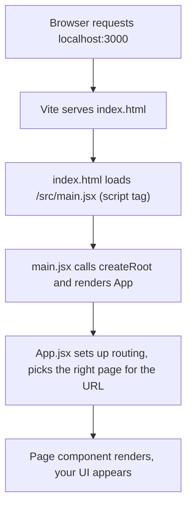

# Chapter 1 — What is React, JSX, and Our Project Structure

> **What you'll learn**
> - What React actually is (and what it isn't)
> - What JSX is and why it looks like HTML
> - Why we use Vite as the build tool
> - How the files in `frontend/src/` are organized and why
> - The "entry chain": how `index.html` boots your entire app
> - Line-by-line walkthrough of `package.json`, `main.jsx`, and `App.jsx`

This is a long chapter on purpose. Once you understand how the app boots, every other chapter will make sense. Don't rush it.

---

## 1. What is React?

**React is a JavaScript library for building user interfaces.**

That sentence sounds boring, so let me unpack it.

### The problem React solves

Imagine you're building a counter button without React. You'd write:

```html
<button id="counter">Clicked 0 times</button>

<script>
  let count = 0;
  const btn = document.getElementById("counter");
  btn.addEventListener("click", () => {
    count++;
    btn.textContent = `Clicked ${count} times`;
  });
</script>
```

Notice the pattern? Every time the data changes, you have to **manually find the DOM element and update it**. This is called **imperative** code — you give the browser step-by-step instructions: "find this, change that, append this".

It's fine for a counter. It's a nightmare for an app with 50 buttons, 30 inputs, modals, lists, and live updates. You'd spend half your time just remembering "when X changes, also update Y, Z, and the title bar".

### How React solves it

React is **declarative**. Instead of writing "find element, change it", you write a function that says **"given this data, here's what the UI should look like"**. React figures out the DOM updates for you.

The same counter in React:

```jsx
function Counter() {
  const [count, setCount] = useState(0);
  return (
    <button onClick={() => setCount(count + 1)}>
      Clicked {count} times
    </button>
  );
}
```

You describe the *result*, not the *steps*. When `count` changes, React re-runs your function, compares the new output to the old, and patches only what actually changed in the real page.

That's the whole pitch:

> **You write a function from data to UI. React handles the DOM.**

### What React is NOT

- Not a framework like Angular — it doesn't dictate routing, forms, data fetching, or styling. You pick those.
- Not a templating language — JSX is just JavaScript with HTML-looking syntax.
- Not magic. It's a library you `import` like any other.

In our project we add the missing pieces ourselves: **react-router-dom** for routing, **axios** for HTTP, **CSS Modules** for styling, **recharts** for charts, **@dnd-kit/core** for drag-and-drop. React itself is intentionally small.

---

## 2. What is JSX?

JSX is the HTML-looking syntax inside React code:

```jsx
const greeting = <h1 className="title">Hello, world</h1>;
```

That line looks like HTML, but it's **not HTML**. The browser can't read it directly. Behind the scenes, a tool (Vite + the React plugin in our case) translates JSX into regular JavaScript function calls before the browser ever sees it. The line above gets compiled to roughly:

```js
const greeting = React.createElement("h1", { className: "title" }, "Hello, world");
```

Nobody wants to write that by hand for every element. JSX exists because reading and writing UI as a tree of HTML-like tags is way more pleasant.

### A few JSX rules to know upfront

These will trip you up otherwise:

1. **JSX returns ONE root element.** A function can't `return <h1/><p/>` — wrap them in a parent or use a Fragment `<>...</>`.
2. **`class` becomes `className`.** Because `class` is a reserved word in JavaScript.
3. **`for` becomes `htmlFor`.** Same reason.
4. **All tags must close.** ``, `<br />`, `<input />` — even self-closing ones need the slash.
5. **Use camelCase for attributes.** `onclick` becomes `onClick`, `tabindex` becomes `tabIndex`.
6. **Curly braces `{}` mean "JavaScript expression".** `<h1>Hello {name}</h1>` injects the value of `name`.

You'll see all of these in action in Chapter 3. For now, just know JSX = "HTML-shaped JavaScript".

---

## 3. Why Vite?

Vite (pronounced "veet", French for "fast") is the **build tool** that:

1. Runs a development server at `http://localhost:3000`
2. Translates JSX into JavaScript on the fly
3. Provides **Hot Module Replacement (HMR)** — when you save a file, only the changed component re-renders, without losing state
4. Bundles your code for production with `npm run build`

You don't really *use* Vite — it just runs in the background. The only Vite file you'll touch is `vite.config.js`, and even that's optional.

Look at our config:

```1:15:frontend/vite.config.js
import { defineConfig } from 'vite'
import react from '@vitejs/plugin-react'

export default defineConfig({
  plugins: [react()],
  server: {
    port: 3000,
    proxy: {
      '/api': {
        target: 'http://localhost:8000',
        changeOrigin: true,
      },
    },
  },
})
```

Two things to notice:

- **`plugins: [react()]`** — registers the React plugin so Vite knows how to compile `.jsx` files
- **`proxy`** — when our frontend (port 3000) makes a request to `/api/anything`, Vite secretly forwards it to the backend (port 8000). This is why we can write `axios.get("/api/auth/me")` in the frontend without worrying about CORS or the full URL during development.

Older React projects used a tool called Create React App with Webpack. It still works but is much slower to start. Vite is the modern default.

---

## 4. Tour of `frontend/src/`

Open the `frontend/src/` folder. Here's what each piece is for:

```
frontend/
├── index.html                  ← the only HTML file in the whole app
├── package.json                ← dependencies + npm scripts
├── vite.config.js              ← dev server config
└── src/
    ├── main.jsx                ← the JS entry point - mounts <App /> into the page
    ├── App.jsx                 ← top-level routing - which page renders for which URL
    │
    ├── api/                    ← Axios HTTP layer (talks to the backend)
    │   ├── client.js           ← shared axios instance + interceptors
    │   ├── auth.js             ← /auth/* endpoints
    │   ├── tasks.js            ← /tasks/* endpoints
    │   └── users.js            ← /users/* endpoints
    │
    ├── context/                ← shared global state (React Context)
    │   └── AuthContext.jsx     ← logged-in user, login(), logout()
    │
    ├── hooks/                  ← custom hooks (reusable stateful logic)
    │   └── useAuth.js          ← shortcut to read AuthContext
    │
    ├── components/             ← reusable building blocks (not whole pages)
    │   ├── Toast.jsx           ← popup notification
    │   ├── CreateTaskModal.jsx ← reusable "create task" modal
    │   ├── ViewTaskModal.jsx   ← reusable "view/edit task" modal
    │   ├── ProtectedRoute.jsx  ← gate for logged-in pages
    │   ├── GuestRoute.jsx      ← gate for login/register
    │   ├── layout/             ← page chrome (Sidebar, Navbar, AppLayout)
    │   ├── sprint/             ← Kanban-board pieces
    │   └── userstory/          ← User-story-specific list
    │
    ├── pages/                  ← full screens (one per URL)
    │   ├── Dashboard/
    │   ├── Login/
    │   ├── Register/
    │   ├── Home/               ← old greeting page (no longer routed)
    │   └── Tasks/
    │       ├── AllTasksPage.jsx
    │       ├── MyTasksPage.jsx
    │       ├── SprintBoardPage.jsx
    │       ├── UserStoryPage.jsx
    │       └── TasksList.jsx   ← shared list logic used by All/My
    │
    └── styles/
        └── global.css          ← CSS variables, base resets
```

**The mental model:** small reusable bits live in `components/`. Whole-screen pages live in `pages/`. Cross-cutting concerns (`context/`, `hooks/`, `api/`) sit at the top level so any page can import them.

You don't *have* to organize React apps this way. There's no rule. We picked this layout because it scales well past 30+ files without things getting lost.

---

## 5. The entry chain — how the app actually starts

Here's the question every beginner asks: **when I run `npm run dev` and visit `http://localhost:3000`, what actually happens?**

The whole boot sequence in 5 steps:



Let's walk it.

### Step 1 — `index.html`

```1:13:frontend/index.html
<!doctype html>
<html lang="en">
  <head>
    <meta charset="UTF-8" />
    <link rel="icon" type="image/svg+xml" href="/favicon.svg" />
    <meta name="viewport" content="width=device-width, initial-scale=1.0" />
    <title>frontend</title>
  </head>
  <body>
    <div id="root"></div>
    <script type="module" src="/src/main.jsx"></script>
  </body>
</html>
```

This is **the only HTML file in the entire app**. Everything you see — the sidebar, the dashboard, the tables — gets injected into that empty `<div id="root"></div>` by JavaScript.

Two important lines:

- **Line 10: `<div id="root"></div>`** — the empty container React will fill. The id `"root"` is just a convention; React doesn't care what you call it.
- **Line 11: `<script type="module" src="/src/main.jsx"></script>`** — tells the browser to load and run `main.jsx`. The `type="module"` part enables ES module imports (`import x from "y"`).

When the browser loads this page, it sees an empty body, then runs `main.jsx`, which fills the empty `#root` div with your React app.

### Step 2 — `main.jsx`

```1:10:frontend/src/main.jsx
import { StrictMode } from 'react'
import { createRoot } from 'react-dom/client'
import './styles/global.css'
import App from './App.jsx'

createRoot(document.getElementById('root')).render(
  <StrictMode>
    <App />
  </StrictMode>,
)
```

Ten lines. Let's read each one.

- **Line 1:** `import { StrictMode } from 'react'`
  - `StrictMode` is a wrapper that turns on extra checks in development. It intentionally double-renders your components in dev to help you spot bugs. It does nothing in production. Wrap your whole app in it.

- **Line 2:** `import { createRoot } from 'react-dom/client'`
  - `react-dom` is the package that connects React to the browser. (There's a separate `react-native` for mobile.) `createRoot` is the modern API for mounting a React app into a DOM element.

- **Line 3:** `import './styles/global.css'`
  - Imports the global stylesheet. Vite handles CSS imports — they get bundled and injected into the page as a `<style>` tag.

- **Line 4:** `import App from './App.jsx'`
  - Imports our top-level `App` component. Note: no curly braces — that's because `App` is exported as the **default** from `App.jsx` (`export default App`). Default exports get any name you choose.

- **Line 6:** `createRoot(document.getElementById('root'))`
  - Finds the `<div id="root">` we saw in `index.html` and tells React "this is your stage".

- **Line 6 (continued):** `.render(...)`
  - Tells React what to draw inside that root.

- **Lines 7-9:** `<StrictMode><App /></StrictMode>`
  - This is JSX. It's saying "render the `App` component, wrapped in `StrictMode`". The whole expression compiles down to a couple of `React.createElement` calls.

- **Line 9:** the trailing comma
  - Just JavaScript syntax (the comma is allowed inside the function call). It has no React meaning.

That's it. **Ten lines to bootstrap an entire app**. From this point on, you live inside `App.jsx` and the components it renders.

### Step 3 — `App.jsx`

This is where routing is set up. Let's read it carefully:

```1:11:frontend/src/App.jsx
import { BrowserRouter, Routes, Route } from "react-router-dom";
import { AuthProvider } from "./context/AuthContext";
import { ProtectedRoute } from "./components/protectedRoute";
import { GuestRoute } from "./components/GuestRoute";
import { LoginPage } from "./pages/Login/LoginPage";
import { RegisterPage } from "./pages/Register/Registerpage";
import { DashboardPage } from "./pages/Dashboard/DashboardPage";
import { AllTasksPage } from "./pages/Tasks/AllTasksPage";
import { MyTasksPage } from "./pages/Tasks/MyTasksPage";
import { SprintBoardPage } from "./pages/Tasks/SprintBoardPage";
import { UserStoryPage } from "./pages/Tasks/UserStoryPage";
```

The imports.

- **Line 1:** Three things from `react-router-dom`:
  - `BrowserRouter` — the routing engine. Listens to URL changes.
  - `Routes` — a container that picks ONE matching `<Route>` to render based on the current URL.
  - `Route` — defines one path-to-component mapping.
- **Lines 2-4:** Our auth context and the two route gatekeepers.
- **Lines 5-11:** Every page component. Notice these are **named exports** (curly braces around them) — different from `App` which used default export.

```25:48:frontend/src/App.jsx
function App() {
  return (
    <BrowserRouter>
      <AuthProvider>
        <Routes>
          {/* Guest routes: only accessible when NOT logged in */}
          <Route element={<GuestRoute />}>
            <Route path="/login" element={<LoginPage />} />
            <Route path="/register" element={<RegisterPage />} />
          </Route>

          {/* Protected routes: only accessible when logged in */}
          <Route element={<ProtectedRoute />}>
            <Route path="/" element={<DashboardPage />} />
            <Route path="/tasks" element={<AllTasksPage />} />
            <Route path="/tasks/my" element={<MyTasksPage />} />
            <Route path="/tasks/sprint" element={<SprintBoardPage />} />
            <Route path="/tasks/user-story" element={<UserStoryPage />} />
          </Route>
        </Routes>
      </AuthProvider>
    </BrowserRouter>
  );
}
```

The component itself.

- **Line 25:** `function App() {` — components are just JavaScript functions. By convention, component names start with a capital letter. (If you named it `app`, React would think you meant the HTML tag `<app>`.)

- **Line 26-27:** `return (` — components must return JSX (or `null`). The parentheses are just so we can spread the JSX over multiple lines.

- **Line 27:** `<BrowserRouter>` — wraps the whole tree. Without this wrapper, none of the other router pieces (`<Route>`, `useNavigate`, `<NavLink>`) would work. Think of it as "turn on routing".

- **Line 28:** `<AuthProvider>` — provides logged-in user info to every page. We'll cover this in detail in Chapter 11. **Order matters here**: `AuthProvider` is *inside* `BrowserRouter` because the auth code might want to call `useNavigate()` (a router hook). It's *outside* `<Routes>` so all pages can read auth state.

- **Line 29:** `<Routes>` — looks at the current URL and renders the matching `<Route>`.

- **Line 30:** `{/* ... */}` — JSX comment syntax. Note the curly braces — they say "this is JavaScript, and the JS is a block comment".

- **Lines 31-34:** A "layout route" — `<Route element={<GuestRoute />}>` doesn't define a path, it just wraps the routes inside it with a guard. `GuestRoute` is a component that says "if the user is logged in, redirect to `/`; otherwise show the child route". This is how `/login` and `/register` get auto-redirected when you're already logged in. We'll build this exact pattern in Chapter 10.

- **Lines 37-43:** Same trick but with `ProtectedRoute` — these pages are only rendered when there's a logged-in user.

- **Line 38:** `<Route path="/" element={<DashboardPage />} />` — when the URL is exactly `/`, render `DashboardPage`. The `element` prop takes a JSX element (note the `<DashboardPage />`, not just `DashboardPage`).

- **Line 50:** `export default App;` — makes `App` available to other files as the default import. This is what `main.jsx` line 4 imports.

You'll get the full router story in Chapter 9. The key takeaway for now is: **`App.jsx` is the URL-to-component map for your entire app.**

---

## 6. `package.json` line by line

`package.json` is the manifest of every Node.js project. It declares your dependencies, your scripts, and metadata.

```1:30:frontend/package.json
{
  "name": "frontend",
  "private": true,
  "version": "0.0.0",
  "type": "module",
  "scripts": {
    "dev": "vite",
    "build": "vite build",
    "lint": "eslint .",
    "preview": "vite preview"
  },
  "dependencies": {
    "@dnd-kit/core": "^6.3.1",
    "axios": "^1.15.0",
    "react": "^19.2.4",
    "react-dom": "^19.2.4",
    "react-router-dom": "^7.14.1",
    "recharts": "^3.2.1"
  },
  "devDependencies": {
    "@eslint/js": "^9.39.4",
    ...
  }
}
```

(Note: `recharts` was added when we built the Dashboard. Yours may differ slightly.)

Field-by-field:

- **`name`** — the project name. Doesn't matter unless you publish to npm.
- **`private: true`** — prevents you from accidentally publishing this to the public npm registry.
- **`version`** — the project's own version. We don't care.
- **`type: "module"`** — tells Node to treat `.js` files as ES modules (so `import` / `export` work). Required for Vite.

### `scripts`

These are commands you can run with `npm run <name>`:

| Command | What it does |
| --- | --- |
| `npm run dev` | Start the Vite dev server. This is what you'll use 99% of the time. |
| `npm run build` | Bundle the app for production (output in `dist/`). |
| `npm run lint` | Run ESLint to check for code quality issues. |
| `npm run preview` | Serve the production build locally to test it. |

### `dependencies` (run in production)

These are shipped to the browser with your app:

| Package | What it does |
| --- | --- |
| **`react`** | The library itself — components, hooks, JSX runtime. |
| **`react-dom`** | The bridge between React and the browser DOM. (`createRoot` lives here.) |
| **`react-router-dom`** | URL-based routing. Provides `BrowserRouter`, `Route`, `<Link>`, `useNavigate`, etc. |
| **`axios`** | HTTP client. Nicer to use than the built-in `fetch`, supports interceptors. |
| **`@dnd-kit/core`** | Drag-and-drop primitives. Used by the Sprint Board's Kanban. |
| **`recharts`** | Declarative React chart library. Powers the Dashboard. |

### `devDependencies` (only used while developing)

These don't end up in the production bundle:

| Package | What it does |
| --- | --- |
| `vite` | The build tool / dev server. |
| `@vitejs/plugin-react` | Teaches Vite how to compile JSX. |
| `eslint` + plugins | Code linter (catches bugs and style issues). |
| `@types/react`, `@types/react-dom` | TypeScript type definitions. Useful even in plain JS for editor autocomplete. |

### About `^` in versions

`"react": "^19.2.4"` means "any 19.x.y where x.y >= 2.4". The caret allows minor and patch updates but not breaking major-version updates.

### `node_modules/` and `package-lock.json`

When you run `npm install`:

- `node_modules/` is the giant folder where all the actual code lives. Never commit it — it's huge and re-creatable.
- `package-lock.json` records the exact versions installed. Commit this so teammates get the same versions.

---

## 7. How to actually run all this

```bash
# from the frontend folder
cd frontend

# install dependencies (only the first time, or after pulling new changes)
npm install

# start the dev server
npm run dev
```

You'll see output like:

```
  VITE v8.0.4  ready in 312 ms

  ➜  Local:   http://localhost:3000/
  ➜  Network: use --host to expose
```

Open `http://localhost:3000` in your browser. If the backend is running, you'll see the login page. If not, the page loads but auth requests fail — that's fine for poking around.

**Hot Module Replacement (HMR):** Save any `.jsx` or `.css` file. The browser updates **without a full reload**. Component state is even preserved across edits. This is one of the biggest productivity wins of modern frontend tooling — get used to it.

---

## 8. Try it yourself

Let's prove you understand the entry chain. Three small experiments:

### Experiment 1 — Change the page title

Open [frontend/index.html](../frontend/index.html). Change line 7:

```html
<title>My React Learning App</title>
```

Save. Look at your browser tab — the title changes. (You may need to refresh the tab; `index.html` itself isn't covered by HMR.)

### Experiment 2 — Break and fix `main.jsx`

Open [frontend/src/main.jsx](../frontend/src/main.jsx). Comment out line 4:

```js
// import App from './App.jsx'
```

Save. The browser will show an error: `App is not defined`. That's because `<App />` on line 8 references a thing that no longer exists.

This proves: **`main.jsx` is what actually pulls `App` into the picture**. Without that import, the app has no content.

Un-comment the line and the app comes back.

### Experiment 3 — Add a temporary banner in `App.jsx`

Open [frontend/src/App.jsx](../frontend/src/App.jsx). Just inside the `<BrowserRouter>` (before `<AuthProvider>`), add:

```jsx
<div style={{ background: "yellow", padding: 8 }}>
  Hi, I'm learning React!
</div>
```

Wait — that won't work. `<BrowserRouter>` only accepts ONE child. Try this instead — wrap both in a Fragment:

```jsx
return (
  <BrowserRouter>
    <>
      <div style={{ background: "yellow", padding: 8 }}>
        Hi, I'm learning React!
      </div>
      <AuthProvider>
        <Routes>...</Routes>
      </AuthProvider>
    </>
  </BrowserRouter>
);
```

Save. Yellow banner appears at the top of every page.

You just hit the "JSX must return one root" rule from earlier. Fragments (`<>...</>`) are how you return multiple sibling elements without an extra `<div>`.

**Remove the banner before moving on.**

---

## 9. Cheat sheet

| Concept | One-liner |
| --- | --- |
| React | A library that turns data into UI. You write a function, React updates the DOM. |
| JSX | HTML-shaped JavaScript. Compiled away before the browser runs your code. |
| Vite | The dev server + build tool. Provides hot reload and bundles for production. |
| `index.html` | The only HTML file. Has an empty `<div id="root">`. |
| `main.jsx` | Mounts `<App />` into `#root` using `createRoot(...).render(...)`. |
| `App.jsx` | Top-level component. Sets up routing and global providers. |
| Component | A function that returns JSX. Names start with a capital letter. |
| Default export | `export default Foo` → `import Foo from "..."` (no braces). |
| Named export | `export function Foo` → `import { Foo } from "..."` (braces). |
| `<StrictMode>` | Wraps app in dev to catch bugs. Causes double-renders intentionally. |
| `package.json` | Lists dependencies, scripts, project metadata. |
| `npm install` | Installs everything from `package.json` into `node_modules/`. |
| `npm run dev` | Starts the Vite dev server on port 3000. |
| HMR | Hot Module Replacement — changes appear without a full page refresh. |

---

## 10. What's next

Now that you understand how the app boots, **Chapter 2** zooms into the smallest unit you'll work with every day: **the component**. We'll dissect `KpiCard` (which we built for the Dashboard) and `Toast` to learn:

- How to define a component
- How to pass data in via **props**
- Why components are reusable
- The difference between a component and a regular function

When you're ready, ask for **Chapter 2 — Components & Props**.

Until then: re-read this chapter once more, do the three experiments, and skim through `App.jsx` and `main.jsx` until they feel familiar.

You've got this.
