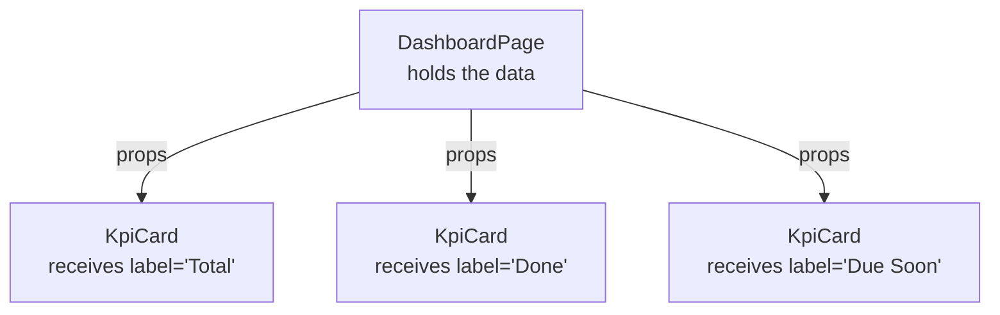
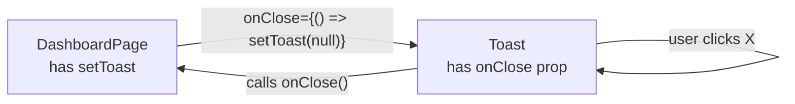

# Chapter 2 — Components & Props

> **What you'll learn**
> - What a component actually is (and why it's just a function)
> - How to define a component and use it in JSX
> - What props are and how data flows from parent to child
> - How to give props **default values**
> - The special `children` prop and why it changes everything
> - Why we destructure props (`{ icon, label }`) instead of using `props.icon`
> - How `KpiCard`, `ChartCard`, and `Toast` are built — line by line

This chapter introduces the **single most important idea in React**. If you understand props, the rest of React is mostly variations on the same theme.

---

## 1. What is a component?

A **component** is a JavaScript function that returns JSX.

That's it. There's no inheritance, no special class to extend, no lifecycle file. Just a function.

```jsx
function Hello() {
  return <h1>Hello, world</h1>;
}
```

That's a complete component. To use it somewhere else, you write `<Hello />` (with capital H — more on that below).

```jsx
function App() {
  return (
    <div>
      <Hello />
      <Hello />
      <Hello />
    </div>
  );
}
```

This renders three "Hello, world" headings. Each `<Hello />` is React saying "call the `Hello` function and put its return value here".

### Why capital letters matter

JSX uses a simple rule:

- **lowercase tag** → real HTML element. `<div>`, `<span>`, `<button>`.
- **Capitalized tag** → custom React component. `<Hello>`, `<KpiCard>`, `<ChartCard>`.

If you wrote `function hello()` and then `<hello />`, React would think you meant the HTML tag `<hello>` (which doesn't exist) and silently render nothing useful. **Always capitalize component names.** Yours, the team's, the library's. Always.

### Components compose

The point of components is **composition**. Build small pieces, combine them. The Dashboard page in our app uses something like:

```jsx
<DashboardPage>
  <KpiCard ... />
  <KpiCard ... />
  <KpiCard ... />
  <KpiCard ... />
  <ChartCard>
    <PieChart>...</PieChart>
  </ChartCard>
  ...
</DashboardPage>
```

You don't write a giant 500-line function. You write a tiny `KpiCard`, then use it four times with different data. That's the magic.

---

## 2. What are props?

**Props** (short for "properties") are the **inputs** to a component. They look exactly like HTML attributes:

```jsx
<KpiCard label="Total Tasks" value={42} />
```

Inside `KpiCard`, the function receives one argument — an object with all the props on it:

```jsx
function KpiCard(props) {
  return <div>{props.label}: {props.value}</div>;
}
```

`props` here is just `{ label: "Total Tasks", value: 42 }`. Plain JavaScript object.

### The data flow rule

Props always flow **one direction**: parent → child. The parent decides what the child gets. The child cannot modify what was passed in. (Try it: `props.label = "X"` won't update the parent.)

This rule sounds restrictive but it's actually liberating: you always know where data came from. There's no spooky "this child changed the parent's variable" debugging.



The parent is the source of truth. Children just render what they're handed.

### Curly braces vs quotes in JSX attributes

You'll see both:

```jsx
<KpiCard label="Total" value={42} accent="blue" />
```

The rule:

- `="..."` → a literal string. Same as HTML.
- `={...}` → a JavaScript expression. Anything you can write in JS goes inside.

So `value={42}` passes the **number** 42. `value="42"` would pass the **string** `"42"`. Different types! For anything that isn't a string (numbers, booleans, arrays, objects, functions, JSX), you need curly braces.

### Passing JSX as a prop

Here's a mind-bender that you'll see all over our Dashboard:

```jsx
<KpiCard icon={<IconTotal />} label="Total Tasks" value={42} />
```

The `icon` prop is **a JSX element**. JSX is just an expression — it can be assigned to variables, passed around, returned, anything. So you can hand a whole `<IconTotal />` to another component as a prop. The receiving component decides where in its layout to place it.

This pattern is everywhere in modern React. Get comfortable with it.

---

## 3. In our app — `KpiCard`

Let's read [frontend/src/pages/Dashboard/widgets/KpiCard.jsx](../frontend/src/pages/Dashboard/widgets/KpiCard.jsx) line by line. The whole file is 14 lines:

```1:14:frontend/src/pages/Dashboard/widgets/KpiCard.jsx
import styles from "../DashboardPage.module.css";

export function KpiCard({ icon, label, value, accent = "blue", subtext }) {
  return (
    <div className={`${styles.kpiCard} ${styles[`accent_${accent}`]}`}>
      <div className={styles.kpiIcon}>{icon}</div>
      <div className={styles.kpiBody}>
        <div className={styles.kpiLabel}>{label}</div>
        <div className={styles.kpiValue}>{value}</div>
        {subtext && <div className={styles.kpiSub}>{subtext}</div>}
      </div>
    </div>
  );
}
```

### Line 1 — `import styles from "../DashboardPage.module.css"`

CSS Modules. We'll cover them in Chapter 23 in depth, but the gist:

- `.module.css` files are **scoped**. The class names you see in the file (`kpiCard`, `kpiIcon`, etc.) get hashed at build time so they don't collide with classes in other files.
- The `import` gives you an **object** where `styles.kpiCard` returns the unique generated class name (e.g. `"DashboardPage_kpiCard__a3f2"`).

So `styles.kpiCard` is just a string. You can use it anywhere a class name is needed.

### Line 3 — the function signature

```jsx
export function KpiCard({ icon, label, value, accent = "blue", subtext }) {
```

Three things happen on this single line. Let's break them apart.

#### a. `export function KpiCard(...)`

`export` makes this function importable from other files. Because it's a **named export** (no `default`), the importer must use curly braces:

```jsx
import { KpiCard } from "./widgets/KpiCard";   // correct
import KpiCard from "./widgets/KpiCard";       // wrong — would import the default, which doesn't exist
```

Compare with `App.jsx` from Chapter 1, which used `export default App;` and was imported without braces. Both styles are valid; we use named exports for components throughout the codebase because it makes refactors safer (renaming the function automatically renames every import).

#### b. The single argument is destructured

The classic way to receive props is:

```jsx
function KpiCard(props) {
  // use props.icon, props.label, props.value
}
```

But our code uses **destructuring** in the parameter list:

```jsx
function KpiCard({ icon, label, value, accent, subtext }) {
  // use icon, label, value directly
}
```

Both are equivalent. Destructuring is just shorter and makes the prop list visible right at the top of the function — you can immediately see what the component accepts. This is the convention you'll see in 99% of React code.

#### c. Default values with `accent = "blue"`

This is plain JavaScript destructuring with defaults. If the parent doesn't pass an `accent` prop, `accent` becomes `"blue"`. If they pass `accent="red"`, it's `"red"`.

That means both of these calls work:

```jsx
<KpiCard label="Total" value={42} />                  {/* accent defaults to "blue" */}
<KpiCard label="Critical" value={3} accent="red" />   {/* accent is "red" */}
```

`subtext` has no default, so if the parent doesn't pass it, it's `undefined`. That's why we have a guard for it on line 10 — more on that below.

### Line 4-5 — building the className

```jsx
<div className={`${styles.kpiCard} ${styles[`accent_${accent}`]}`}>
```

There's a lot in this one line. Let's pry it apart.

The whole `className={...}` value is a **template literal** (the backticks):

```js
`${styles.kpiCard} ${styles[`accent_${accent}`]}`
```

In plain English: "the string `styles.kpiCard`, then a space, then the string `styles.accent_<whatever accent is>`".

If `accent` is `"blue"`, the second part becomes `styles["accent_blue"]`, which evaluates to whatever class name CSS Modules generated for the `.accent_blue` rule in [frontend/src/pages/Dashboard/DashboardPage.module.css](../frontend/src/pages/Dashboard/DashboardPage.module.css).

So the rendered HTML class string ends up looking something like:

```
class="DashboardPage_kpiCard__a3f2 DashboardPage_accent_blue__b1c4"
```

Two classes applied to the div: the base card style, plus the accent variant.

**Why bracket notation?** Because the class name is computed dynamically from the prop. You can't write `styles.accent_blue` if you don't know the value upfront. `styles["accent_" + accent]` is the JavaScript way to look up a property by computed key.

### Line 6 — rendering the icon prop

```jsx
<div className={styles.kpiIcon}>{icon}</div>
```

`{icon}` says "render whatever was passed in the `icon` prop right here". Since the parent passes a JSX element (`<IconTotal />`), that element gets rendered inside this div.

This is the **slot pattern** — `KpiCard` doesn't know or care what the icon looks like. It just provides a styled box and lets the parent fill it. You could pass an ``, an emoji, a third-party icon component, anything.

### Lines 7-9 — label and value slots

```jsx
<div className={styles.kpiBody}>
  <div className={styles.kpiLabel}>{label}</div>
  <div className={styles.kpiValue}>{value}</div>
```

Same pattern. `{label}` injects the string prop. `{value}` injects the number prop. React converts numbers, strings, booleans (sort of — see below), and JSX into displayable output automatically.

> **Heads up:** `false`, `null`, `undefined`, and `true` render as **nothing**. That's actually useful — it's why the next line works.

### Line 10 — conditional rendering

```jsx
{subtext && <div className={styles.kpiSub}>{subtext}</div>}
```

This is the most common conditional pattern in React. Read it as:

> "If `subtext` is truthy, render the div. Otherwise render `false`, which renders as nothing."

It's the JavaScript short-circuit `&&` operator. The expression evaluates to:

- `false` if `subtext` is falsy (undefined, null, "", 0)
- the JSX element if `subtext` is truthy

React happily renders both — but `false` becomes nothing visible.

This is how you say "this part is optional" in JSX. We'll cover `?:` ternaries and other patterns in Chapter 3.

### How it gets used

Open [frontend/src/pages/Dashboard/DashboardPage.jsx](../frontend/src/pages/Dashboard/DashboardPage.jsx) and look at lines 342-345:

```342:345:frontend/src/pages/Dashboard/DashboardPage.jsx
        <KpiCard icon={<IconTotal />} label="Total Tasks" value={kpis.total} accent="blue" subtext="Assigned to you" />
        <KpiCard icon={<IconProgress />} label="In Progress" value={kpis.inProgress} accent="amber" subtext="Currently active" />
        <KpiCard icon={<IconClock />} label="Due Soon" value={kpis.dueSoon} accent="red" subtext="Within 7 days" />
        <KpiCard icon={<IconCheck />} label="Completed" value={kpis.completedThisWeek} accent="green" subtext="Last 7 days" />
```

One component. Four uses. Different icons, labels, values, accent colors, subtexts. **That's reusability**, and it's exactly why we wrote `KpiCard` instead of typing four nearly-identical divs into the dashboard.

If you decided tomorrow that all KPI cards should have a hover animation or a different border, you'd change one place — `KpiCard.jsx` — and all four updates instantly.

---

## 4. In our app — `ChartCard` and the `children` prop

`KpiCard` receives "data" props (icon, label, value). But what if you want a wrapper component that holds **other components** inside it? React has a special prop for that: **`children`**.

Read [frontend/src/pages/Dashboard/widgets/ChartCard.jsx](../frontend/src/pages/Dashboard/widgets/ChartCard.jsx):

```1:16:frontend/src/pages/Dashboard/widgets/ChartCard.jsx
import styles from "../DashboardPage.module.css";

export function ChartCard({ title, subtitle, action, children, className = "" }) {
  return (
    <div className={`${styles.chartCard} ${className}`}>
      <div className={styles.chartHeader}>
        <div>
          <h3 className={styles.chartTitle}>{title}</h3>
          {subtitle && <p className={styles.chartSubtitle}>{subtitle}</p>}
        </div>
        {action}
      </div>
      <div className={styles.chartBody}>{children}</div>
    </div>
  );
}
```

The new bits compared to `KpiCard`:

### `children` is automatic

When a parent writes:

```jsx
<ChartCard title="Status">
  <PieChart>...</PieChart>
</ChartCard>
```

…anything between the opening `<ChartCard>` and the closing `</ChartCard>` becomes the `children` prop. You don't pass it explicitly with `children={...}`. JSX does it for you.

So inside `ChartCard`, `children` is the `<PieChart>` element. Line 13 (`<div className={styles.chartBody}>{children}</div>`) renders it inside the card's body.

This pattern is huge. It's how you build flexible **container components** — wrappers that don't care what's inside. Modal dialogs, page layouts, panels, lists, accordions — all use `children`.

### The `action` prop — JSX as a prop, again

```jsx
{action}
```

`action` is a regular prop, but it's intended to receive JSX (a button, a link, etc.). The dashboard doesn't currently pass an `action`, but if it did:

```jsx
<ChartCard
  title="Sprint Workload"
  action={<button>Refresh</button>}
>
  <BarChart>...</BarChart>
</ChartCard>
```

…the button would appear in the chart card's header next to the title.

**The difference between `children` and `action`:** `children` lives in one slot (between the tags). `action` is a named prop you can place anywhere in the layout. If you only need one slot, use `children`. If you need multiple named slots, use props that take JSX.

### `className = ""` — opting into customization

```jsx
function ChartCard({ ..., className = "" }) {
  return <div className={`${styles.chartCard} ${className}`}>...</div>;
}
```

This lets the parent add extra CSS classes:

```jsx
<ChartCard title="..." className={styles.fullWidth}>...</ChartCard>
```

The default `""` means "if you don't pass it, append nothing". Always default optional string props to `""` (or null) so your template literals don't end up with the word `"undefined"` baked into them.

---

## 5. In our app — `Toast`

`Toast` introduces one new idea: **passing a function as a prop**. Read [frontend/src/components/Toast.jsx](../frontend/src/components/Toast.jsx):

```1:18:frontend/src/components/Toast.jsx
import { useEffect } from "react";
import styles from "./Toast.module.css";

export function Toast({ message, type = "success", onClose, duration = 3000 }) {
  useEffect(() => {
    const timer = setTimeout(onClose, duration);
    return () => clearTimeout(timer);
  }, [onClose, duration]);

  return (
    <div className={`${styles.toast} ${styles[type]}`}>
      <span className={styles.message}>{message}</span>
      <button className={styles.close} onClick={onClose} aria-label="Dismiss">
        &times;
      </button>
    </div>
  );
}
```

(`useEffect` is Chapter 5 — for now just trust that it sets a timer.)

### `onClose` is a function passed by the parent

Look at how it's used in [frontend/src/pages/Dashboard/DashboardPage.jsx](../frontend/src/pages/Dashboard/DashboardPage.jsx):

```322:322:frontend/src/pages/Dashboard/DashboardPage.jsx
        {toast && <Toast message={toast.message} type={toast.type} onClose={() => setToast(null)} />}
```

The parent passes `onClose={() => setToast(null)}` — an arrow function. When the user clicks the dismiss button inside `Toast`, the toast calls that function, which lives in the parent and sets the parent's state.

This is the **call-back pattern**, the only way for a child to "talk back" to its parent. The parent gives the child a function. The child calls it when something happens. The function does whatever the parent wants it to do — usually update state.



Remember: **data flows down, events flow up via callbacks**. That's the core of React's parent-child contract.

### The naming convention

Props that are functions usually start with `on`: `onClose`, `onClick`, `onSubmit`, `onCreated`, `onUpdated`. This mirrors HTML's `onclick` and makes the intent clear: "call this when the corresponding event happens".

You'll see this everywhere in the app: `<CreateTaskModal onClose={...} onCreated={...} />`, `<ViewTaskModal onClose={...} onUpdated={...} />`, etc.

### Default values you've already met

`type = "success"` and `duration = 3000` are the same defaulting trick from `KpiCard`. If the parent passes `<Toast message="Hi" onClose={...} />`, the toast will be a success-type that auto-closes after 3 seconds.

### `&times;` — the X character

`&times;` is the HTML entity for the multiplication sign (`×`), commonly used as a close button. JSX accepts entities just like HTML.

---

## 6. Why destructure? Why default props in the signature?

A common newbie style is:

```jsx
function KpiCard(props) {
  const accent = props.accent || "blue";
  const subtext = props.subtext;
  return (
    <div className={styles[`accent_${accent}`]}>
      ...
    </div>
  );
}
```

This works! But it has problems:

1. **You can't see what props the component takes** without scrolling through the function body looking for `props.X` references.
2. **`||` defaulting is buggy** — `props.value || 0` returns `0` if value is `0`, which is a real value!
3. **More noise** — `props.this`, `props.that` everywhere.

Destructuring with defaults is cleaner and uses JavaScript's proper "missing argument" defaulting:

```jsx
function KpiCard({ icon, label, value, accent = "blue", subtext }) {
```

- One glance: I know exactly which props this component uses.
- `accent = "blue"` only kicks in when `accent` is `undefined`. `accent={0}` would still be `0`.
- No `props.` prefix everywhere.

**Always destructure props in the parameter list.** It's the modern convention.

---

## 7. Try it yourself

### Exercise 1 — read the props

Without running anything, what does this render?

```jsx
function Tag({ label, color = "gray" }) {
  return <span style={{ background: color }}>{label}</span>;
}

<Tag label="urgent" color="red" />
<Tag label="info" />
<Tag label="warn" color="" />
```

Answers:
- First: a red span with text "urgent".
- Second: a gray span with text "info" (default kicked in).
- Third: a span with text "warn" and **no background color** (because `""` is not undefined; the default did NOT kick in). Lesson: defaults only fire for `undefined`.

### Exercise 2 — build a `Stat` component

In your editor, create `frontend/src/playground/Stat.jsx` (you may need to create the `playground` folder):

```jsx
export function Stat({ icon, label, value }) {
  return (
    <div style={{ display: "flex", gap: 8, alignItems: "center" }}>
      <span>{icon}</span>
      <strong>{label}:</strong>
      <span>{value}</span>
    </div>
  );
}
```

Then temporarily import and use it inside `DashboardPage.jsx` (right under the page header would do):

```jsx
import { Stat } from "../../playground/Stat";

// inside the JSX
<Stat icon="📊" label="Hello" value={123} />
```

Save and look at the dashboard. You just built and used a custom component. Delete it before committing.

### Exercise 3 — add a `loading` prop to `KpiCard`

Here's a small redesign challenge. Add a `loading` prop that, when `true`, shows the text "—" instead of the value:

```jsx
export function KpiCard({ icon, label, value, accent = "blue", subtext, loading = false }) {
  return (
    <div className={`${styles.kpiCard} ${styles[`accent_${accent}`]}`}>
      <div className={styles.kpiIcon}>{icon}</div>
      <div className={styles.kpiBody}>
        <div className={styles.kpiLabel}>{label}</div>
        <div className={styles.kpiValue}>{loading ? "—" : value}</div>
        {subtext && <div className={styles.kpiSub}>{subtext}</div>}
      </div>
    </div>
  );
}
```

Notice the new conditional uses the **ternary operator** (`a ? b : c`) — perfect when you have two alternatives. We'll see more of these in Chapter 3.

You don't have to actually wire up the prop in `DashboardPage` — just understanding the change is enough. Revert your edit before moving on.

---

## 8. Cheat sheet

| Concept | One-liner |
| --- | --- |
| Component | A function that returns JSX. Capitalize the name. |
| Props | The single object argument every component receives. Looks like HTML attributes when used. |
| Destructured props | `function Foo({ a, b }) {...}` — preferred over `function Foo(props) {...}`. |
| Default prop value | `function Foo({ a = "blue" })` — only used when `a` is `undefined`. |
| Pass a string | `<Foo name="alice" />` |
| Pass anything else | `<Foo count={42} items={list} render={<X />} />` (curly braces) |
| `children` prop | Whatever's between the opening and closing tags is auto-collected here. |
| Slot pattern | Pass JSX as a prop (`icon={<MyIcon />}`) for named slots. |
| Callback pattern | Parent passes a function (`onClose={...}`); child calls it on events. Convention: name starts with `on`. |
| Conditional render | `{cond && <X />}` — render X if cond is truthy. |
| Ternary render | `{cond ? <A /> : <B />}` — render A or B. |
| Data flow rule | Down via props, up via callback functions. Children never mutate parent data directly. |

---

## 9. What's next

Now that you can build components and pass data into them, **Chapter 3** zooms into the JSX itself. You've already used `{}`, `&&`, and prop interpolation. Next we'll cover:

- `.map()` to render a list
- The `key` prop and why React shouts at you without it
- Conditionals (`&&`, `?:`, `if/else` patterns)
- Fragments (`<> </>`) and when you need them
- Inline styles vs `className`
- Common JSX gotchas (whitespace, comments, attribute names)

When you're ready, ask for **Chapter 3 — JSX Deep Dive**.

You're building real React intuition now. Keep going.
