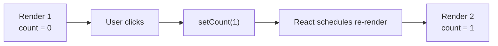
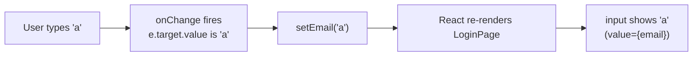

# Chapter 4 — `useState` and Controlled Inputs

> **What you'll learn**
> - Why React needs a special way to remember things (state)
> - How `useState` works and what its weird-looking return value means
> - The mental model: **state changes trigger re-renders**
> - The golden rule: never mutate state — always replace it
> - **Controlled inputs** — letting React own the value of every form field
> - The single-form-object pattern with `[e.target.name]` for many fields
> - The **functional update** form: `setX(prev => ...)` and when you must use it
> - Working with arrays in state (the tags input)
> - When to use one `useState` vs. many

This is **the most important chapter in the whole series**. Once `useState` clicks, you understand how React apps actually feel "alive". Take your time.

---

## 1. The problem `useState` solves

Every React component is just a function that returns JSX. Each render is a fresh call to that function. So if you wrote:

```jsx
function Counter() {
  let count = 0;
  return (
    <button onClick={() => count++}>Clicked {count} times</button>
  );
}
```

…clicking the button would do nothing visible. Why?

1. `count` is a local variable. It exists for the duration of *this* function call and disappears.
2. Even if `count++` happened, **React has no idea anything changed**, so it doesn't re-render.
3. Next render starts a fresh `Counter()` call with `count = 0` again.

We need two things:

1. A **place to store data that survives across renders**.
2. A way to **tell React "something changed, please re-render"**.

Both come from a single function: `useState`.

---

## 2. The shape of `useState`

```js
import { useState } from "react";

const [count, setCount] = useState(0);
```

That one line does several things at once:

- Tells React: "this component needs a piece of state, initialized to `0`".
- React stores `0` somewhere internal.
- Returns an **array of exactly two things**: the current value, and a setter function.
- We immediately destructure that array into `count` and `setCount`.

So after this line:

- `count` → the current number (`0` on first render).
- `setCount(n)` → "tell React the new value is `n`, and re-render this component".

The names `count` / `setCount` are convention. You can name them anything (`x` / `setX`). The pair is just `useState`'s return value.

> **Why an array, not an object?** Because destructuring an array lets you rename the pair on the spot. With an object you'd be stuck with `value` and `setValue` literally. With `const [count, setCount] = useState(0)`, you get nice descriptive names every time.

### The fixed counter

```jsx
import { useState } from "react";

function Counter() {
  const [count, setCount] = useState(0);
  return (
    <button onClick={() => setCount(count + 1)}>
      Clicked {count} times
    </button>
  );
}
```

What happens on click:

1. `setCount(count + 1)` runs. React notes "new value is 1".
2. React schedules a re-render of `Counter`.
3. React calls `Counter()` again.
4. This time `useState(0)` returns `[1, setCount]` (because React remembers the value across renders).
5. The button now reads `Clicked 1 times`.

Notice: **the `0` in `useState(0)` only matters on the very first render.** On subsequent renders, React ignores it and gives back the latest value.

### The mental model



This loop is the heartbeat of every interactive React app. Every time you see something change on the screen, this is what's happening underneath.

---

## 3. The golden rule: replace, don't mutate

This is probably the single biggest beginner trap in React.

**Wrong:**

```jsx
const [user, setUser] = useState({ name: "Alice", age: 30 });

// later, on a button click
user.age = 31;       // ❌ mutating the object directly
setUser(user);       // React sees "same object reference" — won't re-render!
```

**Right:**

```jsx
setUser({ ...user, age: 31 });   // ✅ a new object
```

React decides whether to re-render by comparing the *reference* you passed to `setX` with the previous value. If you mutate the existing object, the reference is identical, and React skips the re-render.

The rule: **always create a new object/array** when updating state.

| Operation | Wrong (mutating) | Right (replacing) |
| --- | --- | --- |
| Update field | `user.x = 5; setUser(user)` | `setUser({ ...user, x: 5 })` |
| Append to array | `arr.push(x); setArr(arr)` | `setArr([...arr, x])` |
| Remove from array | `arr.splice(i, 1); setArr(arr)` | `setArr(arr.filter((_, idx) => idx !== i))` |
| Update array item | `arr[0] = newItem; setArr(arr)` | `setArr(arr.map((it, i) => i === 0 ? newItem : it))` |

You'll see all four of these patterns in our codebase. Memorize them.

---

## 4. In our app — `LoginPage`

Open [frontend/src/pages/Login/LoginPage.jsx](../frontend/src/pages/Login/LoginPage.jsx). The whole component is built around a few `useState` calls.

```10:13:frontend/src/pages/Login/LoginPage.jsx
  const [email, setEmail] = useState("");
  const [password, setPassword] = useState("");
  const [error, setError] = useState("");
  const [submitting, setSubmitting] = useState(false);
```

Four pieces of state:

- `email` and `password` — what the user has typed so far. Initial: empty strings.
- `error` — what to show if the login fails. Initial: empty string (no error).
- `submitting` — `true` while waiting for the server. Initial: `false`.

Each is independent. Changing one doesn't reset the others.

### The controlled input pattern

Look at the email field:

```51:59:frontend/src/pages/Login/LoginPage.jsx
            <input
              id="email"
              type="email"
              value={email}
              onChange={(e) => setEmail(e.target.value)}
              required
              autoComplete="email"
              placeholder="you@example.com"
            />
```

Two props make this a **controlled input**:

1. **`value={email}`** — the input's displayed value comes from React state, not from the DOM.
2. **`onChange={(e) => setEmail(e.target.value)}`** — every keystroke fires this handler. It pulls the new value out of the event and writes it back to state.

The flow on every keystroke:



The input never "owns" its own value. **React owns it.** The input is just a window onto state.

Why bother? Because now `email` is a real JavaScript variable in your component. You can:

- Validate it (`if (!email.includes("@")) ...`)
- Submit it to the server
- Pre-fill it from somewhere
- Clear it programmatically (`setEmail("")`)
- Disable other UI based on it

If the input owned its own value (the way plain HTML works), getting at it would mean DOM queries — `document.getElementById("email").value`. Controlled inputs make every form field as accessible as any other variable.

### The opposite: uncontrolled inputs

For completeness — you *can* let the DOM own the value:

```jsx
<input type="email" defaultValue="hi@x.com" />
```

That's an **uncontrolled input**. React sets the initial value but never tracks changes. To read the value you'd need a ref. We don't use this pattern in our app — controlled is the standard.

### Putting state to work in the JSX

The submit button uses two pieces of state at once:

```75:81:frontend/src/pages/Login/LoginPage.jsx
          <button
            type="submit"
            className={styles.button}
            disabled={submitting}
          >
            {submitting ? "Signing in..." : "Sign in"}
          </button>
```

While `submitting` is `true`:
- The button is disabled (can't double-click).
- The label changes to "Signing in...".

This is the typical "submit + spinner + lock" pattern, expressed as plain JSX driven by state.

The error message uses the `&&` short-circuit you learned in Chapter 3:

```47:47:frontend/src/pages/Login/LoginPage.jsx
          {error && <div className={styles.error}>{error}</div>}
```

If `error` is the empty string (falsy), nothing renders. The moment `setError("Invalid password")` is called, the div appears.

### Reading state inside an async handler

```15:38:frontend/src/pages/Login/LoginPage.jsx
  const handleSubmit = async (e) => {
    // Prevent the browser's default form submission (full page reload).
    e.preventDefault();

    setError("");
    setSubmitting(true);

    try {
      await login(email, password);
      // ...
      navigate("/", { replace: true });
    } catch (err) {
      const message =
        err.response?.data?.detail || "Something went wrong. Try again.";
      setError(message);
    } finally {
      setSubmitting(false);
    }
  };
```

Several things to notice:

1. **`e.preventDefault()`** — without this, the browser would do a full-page form submission and your `await` would never get to run. Always call this in form handlers.
2. **`email` and `password` come from the closure.** When `handleSubmit` runs, they're whatever they were when this render of `LoginPage` happened. (This is the source of "stale closure" bugs we'll cover in Chapter 8.)
3. **Multiple `setX` calls in a row.** React batches them — only one re-render happens at the end of `handleSubmit`, not three.
4. **`finally`** clears `submitting` whether the request succeeded or failed. Without it, a failed login would leave the button locked forever.

---

## 5. In our app — `CreateTaskModal` (single-form-object pattern)

`LoginPage` has two fields, so two `useState` calls is fine. But what about `CreateTaskModal`, which has eight fields? Eight `useState` calls would work, but there's a tidier pattern.

Open [frontend/src/components/CreateTaskModal.jsx](../frontend/src/components/CreateTaskModal.jsx).

### One state object for the whole form

```32:41:frontend/src/components/CreateTaskModal.jsx
const INITIAL_FORM = {
  title: "",
  description: "",
  status: "todo",
  priority: "medium",
  task_type: "task",
  sprint: "",
  due_date: defaultDueDate(),
  assignee_id: "",
};
```

```43:48:frontend/src/components/CreateTaskModal.jsx
export function CreateTaskModal({ onClose, onCreated }) {
  const [form, setForm] = useState(INITIAL_FORM);
  const [tags, setTags] = useState([]);
  const [tagInput, setTagInput] = useState("");
  const [users, setUsers] = useState([]);
  const [submitting, setSubmitting] = useState(false);
  const [error, setError] = useState("");
```

`form` is one state value — a single object holding all the fields. `tags` is a separate array because tags are managed differently. `users`, `submitting`, `error` are also their own pieces.

> **When to use one big object vs. many small `useState` calls?**
> - Tightly related fields that always change together (a form, a coordinate, a date range): one object.
> - Independent concerns (loading flag, error message, fetched data): separate `useState` per concern.
> - When in doubt, separate. It's almost always cheaper to combine later than to split apart.

### One handler for every field — the `name` trick

```57:59:frontend/src/components/CreateTaskModal.jsx
  const handleChange = (e) => {
    setForm((prev) => ({ ...prev, [e.target.name]: e.target.value }));
  };
```

Three things happen here. Read them slowly.

1. **`setForm((prev) => ...)`** — the **functional update** form. We pass a function instead of a value. React calls it with the *current* state and uses the return value as the new state. (More on why we prefer this in section 7.)
2. **`{ ...prev, ... }`** — spread the previous form into a new object so we keep the other fields unchanged.
3. **`[e.target.name]: e.target.value`** — computed property name. The square brackets mean "use the value of `e.target.name` as the key".

So if the user types in the input named `"title"`, this becomes `{ ...prev, title: "whatever they typed" }`. If they pick from the `"status"` select, it becomes `{ ...prev, status: "in_progress" }`.

**One handler, every field.** Compare with `LoginPage` which had `setEmail` for the email and `setPassword` for the password — fine for two fields, tedious for eight. The `name`/`handleChange` pattern is how big forms stay clean.

### Wiring inputs to the form object

```119:128:frontend/src/components/CreateTaskModal.jsx
            <input
              name="title"
              type="text"
              value={form.title}
              onChange={handleChange}
              required
              maxLength={200}
              placeholder="What needs to be done?"
              className={styles.titleInput}
            />
```

Three required pieces:

- `name="title"` — keyed into the form object.
- `value={form.title}` — controlled value.
- `onChange={handleChange}` — the shared handler.

Same shape repeats for every input and select in the modal:

```180:184:frontend/src/components/CreateTaskModal.jsx
                <select id="ct-status" name="status" value={form.status} onChange={handleChange}>
                  {STATUS_OPTIONS.map((o) => (
                    <option key={o.value} value={o.value}>{o.label}</option>
                  ))}
                </select>
```

Notice: a `<select>` works exactly like an `<input>`. Same `value` + `onChange` API. So do `<textarea>` and `<input type="checkbox">` (with `checked` instead of `value` for checkboxes).

### Derived state — never store what you can compute

```55:55:frontend/src/components/CreateTaskModal.jsx
  const selectedUser = users.find((u) => u._id === form.assignee_id);
```

`selectedUser` is **derived** from `users` and `form.assignee_id`. Both already live in state. We compute `selectedUser` fresh every render — it's just a regular variable, not a `useState`.

The temptation as a beginner is to add a `useState` for this and update it whenever `form.assignee_id` changes. **Don't.** That's three problems waiting to happen:

1. Two sources of truth — they can drift out of sync.
2. An extra `useEffect` to keep them aligned.
3. An extra render cycle.

**Anything you can compute from existing state should be a regular variable**, not its own `useState`. We'll formalize this in Chapter 6 with `useMemo` (for expensive computations).

The selected user's email and department are read-only fields driven by this derivation:

```151:158:frontend/src/components/CreateTaskModal.jsx
                <input
                  id="ct-email"
                  type="email"
                  value={selectedUser?.email || ""}
                  readOnly
                  className={styles.readonlyInput}
                  placeholder="—"
                />
```

`readOnly` makes the input non-editable. The user picks an assignee from the select; the email and department auto-fill because they're computed from `selectedUser`. No state, no effect — just a derivation.

---

## 6. Working with arrays in state — the tags input

`tags` is a list. Every operation creates a brand new array (the golden rule).

### Adding

```61:65:frontend/src/components/CreateTaskModal.jsx
  const addTag = () => {
    const val = tagInput.trim().toLowerCase();
    if (val && !tags.includes(val)) setTags((prev) => [...prev, val]);
    setTagInput("");
  };
```

`[...prev, val]` is "spread the previous array, then append `val`". Brand new array, React re-renders.

We also clear `tagInput` to empty so the input goes blank after the chip appears.

### Removing

```67:67:frontend/src/components/CreateTaskModal.jsx
  const removeTag = (t) => setTags((prev) => prev.filter((x) => x !== t));
```

`.filter()` returns a new array containing everything except `t`. Brand new array, React re-renders.

### Combining with key events

```69:72:frontend/src/components/CreateTaskModal.jsx
  const handleTagKeyDown = (e) => {
    if (e.key === "Enter") { e.preventDefault(); addTag(); }
    if (e.key === "Backspace" && !tagInput && tags.length) removeTag(tags[tags.length - 1]);
  };
```

This is a slick UX touch:
- Enter adds the typed tag.
- Backspace on an empty input removes the *last* tag (so the input feels like a chat composer).

Notice it reads `tagInput` and `tags` from the closure — they were the values at the moment React rendered this version of the component. This works fine here because React re-renders on every keystroke.

### Rendering the chips

```250:266:frontend/src/components/CreateTaskModal.jsx
            <div className={styles.tagInputWrap}>
              {tags.map((t) => (
                <span key={t} className={styles.tag}>
                  {t}
                  <button type="button" className={styles.tagRemove} onClick={() => removeTag(t)}>×</button>
                </span>
              ))}
              <input
                type="text"
                value={tagInput}
                onChange={(e) => setTagInput(e.target.value)}
                onKeyDown={handleTagKeyDown}
                onBlur={addTag}
                placeholder={tags.length === 0 ? "Type a tag and press Enter..." : ""}
                className={styles.tagField}
              />
            </div>
```

Pure Chapter-3 territory: `.map()` over the array, key per chip, controlled input for the new-tag text.

`onBlur={addTag}` is a nice touch — if the user clicks away after typing a tag, we add it for them. Small touches like this are the difference between "form" and "polished form".

---

## 7. Functional updates — `setX(prev => ...)` and why it matters

Both forms work most of the time:

```js
setCount(count + 1);          // direct
setCount((prev) => prev + 1); // functional
```

But they differ in one critical way: **the direct form uses the value of `count` from the moment this render captured it.** The functional form uses whatever React's most recent state is when the update actually applies.

When does this matter? Two situations:

### a. Multiple updates in a row

```js
setCount(count + 1);
setCount(count + 1);
setCount(count + 1);
```

If `count` is `0`, this still ends at `1`, not `3`. Why? Because all three calls reference the same captured `count = 0`. React applies `0 + 1` three times, ending at `1`.

```js
setCount((prev) => prev + 1);
setCount((prev) => prev + 1);
setCount((prev) => prev + 1);
```

This ends at `3`. Each call receives the *previous* value React was about to set, then returns the next.

### b. Stale closures (timers, callbacks)

```js
useEffect(() => {
  const id = setInterval(() => setCount(count + 1), 1000);
  return () => clearInterval(id);
}, []);  // empty deps — runs once
```

The interval callback captures `count = 0` from the first render and never sees later values. The counter would forever read "Clicked 1 times". The functional form fixes it:

```js
const id = setInterval(() => setCount((prev) => prev + 1), 1000);
```

Now each tick reads the current value. We'll see real examples of this in Chapter 5.

### Where you'll find functional updates in our code

```156:156:frontend/src/pages/Tasks/TasksList.jsx
    setRefetchKey((k) => k + 1);
```

```47:47:frontend/src/pages/Tasks/TasksList.jsx
        onClick={() => setOpen((o) => !o)}
```

```171:171:frontend/src/pages/Tasks/TasksList.jsx
    setMenuTaskId((prev) => (prev === taskId ? null : taskId));
```

Every time you see `setX((something) => ...)`, it's the functional form. **Use it whenever the next value depends on the previous one** — even when it would technically work without. Cheap insurance.

---

## 8. Don't put hooks inside conditions or loops

A teaser of Chapter 8, but you need to know it now: hooks like `useState` must be called **at the top of your component, in the same order, every render**.

**Wrong:**

```jsx
function Foo({ showCount }) {
  if (showCount) {
    const [count, setCount] = useState(0);   // ❌ conditional hook
  }
  // ...
}
```

**Right:**

```jsx
function Foo({ showCount }) {
  const [count, setCount] = useState(0);     // ✅ unconditional
  if (!showCount) return null;
  // ...
}
```

React tracks state by call order. If the order changes between renders, React loses track of which `useState` is which. ESLint will warn you about this — listen to it.

**Practical rule:** put all your `useState` calls at the very top of the component, before any `if`, `return`, or `for` loop.

---

## 9. Try it yourself

### Exercise 1 — Build a toggle

Sketch a component that has a button labeled "Hide" / "Show" and a paragraph below it. Clicking toggles visibility.

<details>
<summary>Solution</summary>

```jsx
function Toggleable() {
  const [open, setOpen] = useState(true);
  return (
    <>
      <button onClick={() => setOpen((o) => !o)}>{open ? "Hide" : "Show"}</button>
      {open && <p>Hello, I'm visible.</p>}
    </>
  );
}
```

Note the functional update `setOpen((o) => !o)` — exactly the pattern from `GroupSection` in `TasksList.jsx`.
</details>

### Exercise 2 — Spot the mutation bug

Why does this not work?

```jsx
const [user, setUser] = useState({ name: "", age: 0 });

function handleAge(e) {
  user.age = Number(e.target.value);
  setUser(user);
}
```

<details>
<summary>Answer</summary>

`user.age = ...` mutates the existing object. `setUser(user)` then passes the same reference back to React, which sees no change and does not re-render. Fix: `setUser({ ...user, age: Number(e.target.value) })`.
</details>

### Exercise 3 — Why functional update?

This counter button is supposed to increment 3 times per click but ends at +1. Why?

```jsx
function Triple() {
  const [n, setN] = useState(0);
  return <button onClick={() => {
    setN(n + 1);
    setN(n + 1);
    setN(n + 1);
  }}>n = {n}</button>;
}
```

<details>
<summary>Answer</summary>

All three calls capture `n` from the current render. If `n` was `0`, all three set `0 + 1 = 1`. Fix:

```jsx
setN((p) => p + 1);
setN((p) => p + 1);
setN((p) => p + 1);
```

Now each call reads the previous "to be set" value.
</details>

### Exercise 4 — Build the form-object pattern

Create a tiny `Profile` form with two fields (`name`, `email`) using the **single-state-object pattern** like `CreateTaskModal`.

<details>
<summary>Solution</summary>

```jsx
function Profile() {
  const [form, setForm] = useState({ name: "", email: "" });
  const onChange = (e) => setForm((p) => ({ ...p, [e.target.name]: e.target.value }));
  return (
    <form onSubmit={(e) => { e.preventDefault(); console.log(form); }}>
      <input name="name" value={form.name} onChange={onChange} />
      <input name="email" type="email" value={form.email} onChange={onChange} />
      <button>Submit</button>
    </form>
  );
}
```
</details>

---

## 10. Cheat sheet

| Concept | One-liner |
| --- | --- |
| Declare state | `const [x, setX] = useState(initial)` |
| Replace state | `setX(newValue)` |
| Functional update | `setX((prev) => newValueFromPrev)` — use when next depends on previous |
| Update object field | `setObj((p) => ({ ...p, key: value }))` |
| Append to array | `setArr((p) => [...p, item])` |
| Remove from array | `setArr((p) => p.filter((x) => x !== item))` |
| Replace item in array | `setArr((p) => p.map((x, i) => i === idx ? newX : x))` |
| Controlled input | `<input value={x} onChange={(e) => setX(e.target.value)} />` |
| One handler for many fields | `name="title"` + `setForm((p) => ({ ...p, [e.target.name]: e.target.value }))` |
| Derived state | A regular variable — don't put it in `useState` |
| Hooks rule | Always at the top, never inside `if`/`for`/conditions |
| Initial state | The argument to `useState(initial)` is only used on first render |

---

## 11. What's next

You can now build forms, toggles, counters, modals — any UI that responds to user input.

But what about things that need to happen **outside the input → state → render** loop? Like:

- Fetching data when the component mounts
- Setting up a timer
- Listening to keyboard events on the document
- Cleaning up when the component unmounts

That's what `useEffect` is for. **Chapter 5** dissects:

- The `fetchUser` effect in [AuthContext.jsx](../frontend/src/context/AuthContext.jsx) (load user on mount)
- The debounced search input in [TasksList.jsx](../frontend/src/pages/Tasks/TasksList.jsx) (timer + cleanup)
- The dependency array — your most important and most error-prone friend

When you're ready, ask for **Chapter 5 — `useEffect` Side Effects, Dependencies, and Cleanup**.

You've crossed the biggest mental hurdle in React. Everything from here is pattern variations on what you already know.
