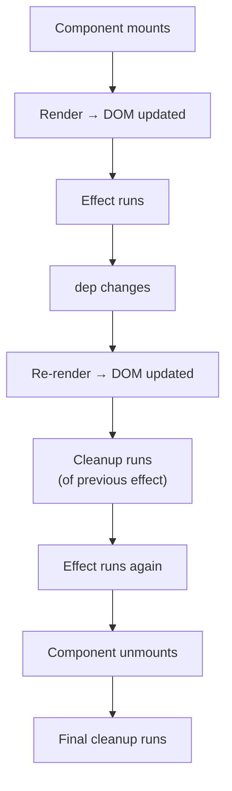

# Chapter 5 — `useEffect`: Side Effects, Dependencies, and Cleanup

> **What you'll learn**
> - What a "side effect" is, and why React needs a special place for them
> - The three parts of every `useEffect`: the effect, the cleanup, and the dependency array
> - The four most common patterns: **run once**, **run when X changes**, **run on every render**, and **run + clean up**
> - How **debouncing** is built from `setTimeout` + cleanup
> - The infinite-loop trap and how to spot it
> - Real walk-throughs of `AuthContext` (mount-only fetch) and `TasksList` (debounce, click-outside listener, refetch-on-filter-change)

If Chapter 4 (`useState`) was about how UI **reacts** to user input, Chapter 5 is about how your component talks to the **outside world** — the network, the DOM, timers, browser APIs. This is the second-most-important hook.

---

## 1. What is a "side effect"?

A pure function takes inputs and returns outputs. Same input → same output, no surprises:

```js
function add(a, b) { return a + b; }
```

A **side effect** is anything that touches the world *outside* the function:

- Calling an API (`fetch`, `axios`)
- Reading or writing `localStorage`
- Setting up a `setTimeout` or `setInterval`
- Adding an event listener to `window` or `document`
- Manually focusing an input via DOM
- Logging to the console
- Sending analytics events

A React component's body is supposed to be **as pure as possible**: take props + state, return JSX. So where do side effects live?

Inside `useEffect`.

---

## 2. The shape of `useEffect`

```js
useEffect(() => {
  // 1. The effect — runs after React commits the render
  console.log("hello");

  // 2. (optional) cleanup — runs before the next effect, and on unmount
  return () => console.log("goodbye");
}, [dep1, dep2]);  // 3. The dependency array
```

Three pieces:

1. **The effect function** — runs *after* React paints the DOM. (Important: not before. The user sees the screen first, then your effect runs.)
2. **The cleanup function** — optional. Returned from the effect. React calls it when the dependencies change (before re-running the effect) and when the component unmounts.
3. **The dependency array** — controls *when* the effect runs.

The dependency array is everything. Get it right and your effect behaves. Get it wrong and you have either a stale bug or an infinite loop.

### The three flavors of dependency array

```js
useEffect(() => {...});           // (no array) runs after EVERY render — almost never what you want
useEffect(() => {...}, []);       // empty array — runs ONCE on mount, cleanup on unmount
useEffect(() => {...}, [x, y]);   // runs when x or y changes (and on mount)
```

Read those three until they're burned in. 95% of effects are one of the bottom two forms.

---

## 3. The lifecycle of an effect



Two crucial things to internalize:

1. **The effect runs *after* the render is on screen.** Inside the effect, the DOM is already there.
2. **Cleanup always pairs with its effect.** Before any new effect runs, the previous one's cleanup runs first. This is what makes effects safely repeatable.

---

## 4. Pattern A — "Run once on mount"

The classic: load some data when the component appears.

### In our app — `AuthContext`

When the app loads, we need to know if the user is already logged in (maybe their access token is still valid in `localStorage`). We do that in [frontend/src/context/AuthContext.jsx](../frontend/src/context/AuthContext.jsx):

```45:47:frontend/src/context/AuthContext.jsx
  useEffect(() => {
    fetchUser();
  }, [fetchUser]);
```

What happens:

1. `AuthProvider` mounts (only once, at the top of the app).
2. React commits the first render — the `loading` div is on screen.
3. The effect runs: it calls `fetchUser()`.
4. `fetchUser` makes a `GET /auth/me` request.
5. When it resolves, `setUser(data)` and `setLoading(false)` trigger a re-render.
6. Now `ProtectedRoute` knows whether to show the app or redirect to `/login`.

### Why is `fetchUser` in the dependency array?

You might expect `[]` (run once). But `fetchUser` is a function defined inside the component, so technically it's "used" by the effect. ESLint's `react-hooks/exhaustive-deps` rule is strict: **anything from outside that the effect uses must be in the array**.

Here's where `useCallback` comes in:

```27:39:frontend/src/context/AuthContext.jsx
  const fetchUser = useCallback(async () => {
    try {
      const data = await authApi.getMe();
      setUser(data);
    } catch {
      setUser(null);
    } finally {
      setLoading(false);
    }
  }, []);
```

`useCallback(fn, [])` returns the **same function reference** on every render (until its own deps change). Because its deps are `[]`, the reference is stable forever. So `useEffect(fetchUser, [fetchUser])` effectively runs once.

We'll cover `useCallback` properly in Chapter 6. For now, the takeaway:

> **If your effect uses a function declared in the same component, wrap that function in `useCallback` and list it in the deps. This satisfies the linter and stays correct.**

### Why `loading` starts as `true`

```12:21:frontend/src/context/AuthContext.jsx
  // `loading` starts as true. This is critical for preventing
  // a "flash of login page" on hard refresh.
  //
  // Without it: App mounts -> user is null -> ProtectedRoute redirects
  // to /login -> THEN the /me call finishes and we realize the user
  // was logged in all along. Bad UX.
  //
  // With it: App mounts -> loading is true -> we show nothing (or a
  // spinner) -> /me call finishes -> THEN we render the right page.
  const [loading, setLoading] = useState(true);
```

This is the **race condition** every async-on-mount effect needs to handle. The very first render happens *before* the effect runs. If we treat that "user is null" moment as "user is logged out", we redirect them to login by mistake. The `loading` flag is a placeholder state that says "I don't know yet, wait."

---

## 5. Pattern B — "Run when X changes"

This is the most common form. The effect re-runs whenever one of its dependencies changes.

### In our app — refetching tasks when filters change

```110:139:frontend/src/pages/Tasks/TasksList.jsx
  useEffect(() => {
    const filters = {};
    if (debouncedTitle) filters.title = debouncedTitle;
    if (statusFilter) filters.status = statusFilter;
    if (priorityFilter) filters.priority = priorityFilter;
    if (lockedTypeFilter) {
      filters.task_type = lockedTypeFilter;
    } else if (typeFilter) {
      filters.task_type = typeFilter;
    }
    if (lockedAssigneeId) {
      filters.assignee_id = lockedAssigneeId;
    } else if (assigneeFilter) {
      filters.assignee_id = assigneeFilter;
    }
    if (excludeTypeFilter) filters.exclude_task_type = excludeTypeFilter;
    fetchTasks(page, filters);
  }, [
    page,
    debouncedTitle,
    statusFilter,
    priorityFilter,
    typeFilter,
    assigneeFilter,
    lockedAssigneeId,
    lockedTypeFilter,
    excludeTypeFilter,
    refetchKey,
    fetchTasks,
  ]);
```

Read this slowly. The effect:

1. Builds a `filters` object from the current state.
2. Calls `fetchTasks(page, filters)`.

The dependency array lists **every value the effect reads**. The result: any time the page changes, or any filter changes, or `refetchKey` is bumped, this effect re-runs and re-fetches.

This is the heart of "reactive data fetching". You don't write "when this dropdown changes, refetch". You write "the data depends on these values" and React figures out when to refetch.

### Why `refetchKey`?

Look at line 156, the create-task success handler:

```153:157:frontend/src/pages/Tasks/TasksList.jsx
  const handleCreated = () => {
    setModalOpen(false);
    setToast({ message: "Task created successfully!", type: "success" });
    setRefetchKey((k) => k + 1);
  };
```

After creating a task, none of `page`, `statusFilter`, etc. have changed. The filter-driven effect won't re-run on its own. But we *do* want a fresh fetch (the new task should appear).

Solution: a "version counter" called `refetchKey`. Bump it, and the effect's dependency list changes, so it re-runs. It's a polite way to say "please refetch, no questions asked".

You'll see this pattern under different names: `refetchKey`, `version`, `reloadToken`. Same idea.

### The reset-to-page-1 effect

```141:143:frontend/src/pages/Tasks/TasksList.jsx
  useEffect(() => {
    setPage(1);
  }, [debouncedTitle, statusFilter, priorityFilter, typeFilter, assigneeFilter]);
```

When a filter changes, jump to page 1. (Otherwise you might be on page 7 of "no results found".)

Notice: this effect calls `setPage`, which triggers a re-render, which re-evaluates the *other* effect, which refetches. Effects can chain through state changes — but **never call a state setter that would re-trigger the same effect**, or you'll loop. (More on infinite loops in section 9.)

---

## 6. Pattern C — Effect with cleanup (debounce)

Cleanup is what makes `useEffect` safe to run repeatedly. Best example in the codebase: the search debounce.

### The problem

The user types `"react app"` in the search box. That's nine keystrokes. We don't want to make nine API calls — we want **one** API call, after they've stopped typing for a moment.

### The solution

```83:86:frontend/src/pages/Tasks/TasksList.jsx
  useEffect(() => {
    const timer = setTimeout(() => setDebouncedTitle(titleSearch), 400);
    return () => clearTimeout(timer);
  }, [titleSearch]);
```

Eleven lines that hold the entire concept of debouncing. Trace through it:

| Time | What happens |
| --- | --- |
| t=0 | User types `"r"`. `titleSearch = "r"`. Effect runs: schedule timer A (400ms). |
| t=100 | User types `"e"`. `titleSearch = "re"`. **Cleanup of timer A runs** (`clearTimeout`). Effect runs again: schedule timer B. |
| t=200 | User types `"a"`. Cleanup of timer B. Schedule timer C. |
| t=300 | User types `"c"`. Cleanup of timer C. Schedule timer D. |
| t=400 | User types `"t"`. Cleanup of timer D. Schedule timer E. |
| t=500 | (silence) |
| t=800 | User typed nothing for 400ms. Timer E fires: `setDebouncedTitle("react")`. |
| t=800 | `debouncedTitle` changed → the *other* effect re-runs → API call fires. **One** API call for five keystrokes. |

The key insight: **cleanup always runs before the next effect**. So every previous timer is cancelled the moment the user types again. Only the *last* timer survives — and it only survives if 400ms of silence pass.

### Why two state variables?

```68:78:frontend/src/pages/Tasks/TasksList.jsx
  const [titleSearch, setTitleSearch] = useState("");
  // ...
  const [debouncedTitle, setDebouncedTitle] = useState("");
```

- `titleSearch` updates on every keystroke → the input feels instant.
- `debouncedTitle` only updates after the user pauses → the API call waits.

The debounce effect bridges the two. The input is bound to `titleSearch`. The fetch effect depends on `debouncedTitle`. Beautifully decoupled.

```374:380:frontend/src/pages/Tasks/TasksList.jsx
          <input
            type="text"
            placeholder="Search by title..."
            value={titleSearch}
            onChange={(e) => setTitleSearch(e.target.value)}
            className={styles.searchInput}
          />
```

The input doesn't care about debouncing. It just talks to `titleSearch`. The debounce is invisible to it.

---

## 7. Pattern D — Listening to global events (with cleanup)

Whenever you `addEventListener` on `document` or `window`, you must `removeEventListener` on cleanup. Otherwise listeners pile up forever.

### In our app — close the action menu when clicking outside

```162:167:frontend/src/pages/Tasks/TasksList.jsx
  useEffect(() => {
    if (!menuTaskId) return;
    const close = (e) => { if (menuRef.current && !menuRef.current.contains(e.target)) setMenuTaskId(null); };
    document.addEventListener("mousedown", close);
    return () => document.removeEventListener("mousedown", close);
  }, [menuTaskId]);
```

Walk-through:

1. **`if (!menuTaskId) return;`** — if no menu is open, do nothing. (Returning early from an effect is allowed and common. It just means "this render: no effect needed.")
2. Define `close`: a handler that closes the menu if the click landed *outside* the menu's DOM node.
3. Subscribe to `mousedown` on the entire document.
4. **Return a cleanup** that unsubscribes.

When does cleanup matter here?

- When `menuTaskId` changes (user opened a different task's menu): cleanup the old listener, subscribe a new one.
- When `menuTaskId` becomes `null` (menu closed): cleanup, then the early-return prevents a new subscription.
- When the component unmounts: cleanup, so we don't leave dangling listeners on `document`.

Without cleanup, every open-and-close cycle would leave a listener attached. After ten clicks you'd have ten listeners all firing on every mousedown. After a thousand, the page would lag.

> **Rule: every `addEventListener` in a `useEffect` needs a matching `removeEventListener` in cleanup.** Same for `setInterval` (`clearInterval`), subscriptions (`unsubscribe`), `WebSocket` (`close`), etc.

`menuRef.current` is a DOM reference — the topic of Chapter 7. For now, treat it as "the actual `<div>` element of the menu in the page".

---

## 8. The "no array" form (almost never use it)

```js
useEffect(() => {
  console.log("rendered");
});  // no array
```

This runs after **every** render. In practice this is almost always wrong:

- Every time anything changes, the effect re-fires.
- If the effect calls `setX`, you get an infinite loop.

The legitimate use cases are vanishingly rare (e.g., logging every render for debugging). When you find yourself reaching for this form, almost certainly the answer is "you needed dependencies".

---

## 9. The infinite loop trap

This is the single most common bug new React developers create:

```jsx
const [tasks, setTasks] = useState([]);

useEffect(() => {
  setTasks([...tasks, "new"]);
}, [tasks]);
```

What happens:

1. Render 1: `tasks = []`. Effect runs: `setTasks(["new"])`.
2. `tasks` changed → re-render.
3. Render 2: `tasks = ["new"]`. Effect runs: `setTasks(["new", "new"])`.
4. Render 3: `tasks = ["new", "new"]`. Effect runs: `setTasks(["new", "new", "new"])`.
5. Browser explodes.

The bug: the effect both *reads* `tasks` and *writes* to it, with `tasks` in the deps.

**How to avoid it:**

- Don't put state in the deps if your effect updates that same state.
- Use the functional update form: `setTasks((prev) => [...prev, "new"])`. Then `tasks` doesn't need to be in the deps.
- Or restructure: put the side-effect *outside* the effect — usually in an event handler.

### The other infinite loop — object/array deps

```jsx
useEffect(() => { fetchData(filters); }, [filters]);  // filters = { status: "todo" }
```

If `filters` is an object created inline somewhere on every render, its reference changes every render → the effect runs every render → bad.

Fix: either keep `filters` as state (state values stay stable across renders), or wrap it in `useMemo` (Chapter 6).

In our `TasksList`, the `filters` object is built **inside** the effect, not outside. That's deliberate: it can change every render and it doesn't matter, because it's not a dep.

---

## 10. Effects with `then` or async — a note

You can't mark the effect callback itself as `async`:

```jsx
useEffect(async () => { ... }, []);  // ❌ React warns
```

Why? React expects the function to return either nothing or a cleanup function. An `async` function returns a Promise — which React would try to use as cleanup and crash.

The two valid patterns:

**a. `.then()`:**

```jsx
useEffect(() => {
  usersApi.listUsers().then(setUsers).catch(() => {});
}, []);
```

This is what we do for the user list:

```88:90:frontend/src/pages/Tasks/TasksList.jsx
  useEffect(() => {
    usersApi.listUsers().then(setUsers).catch(() => {});
  }, []);
```

Run once on mount, fetch users, populate state. The `.catch(() => {})` swallows errors silently — fine for a non-critical filter dropdown.

**b. Inner async function:**

```jsx
useEffect(() => {
  const load = async () => {
    try {
      const data = await usersApi.listUsers();
      setUsers(data);
    } catch (err) {
      console.error(err);
    }
  };
  load();
}, []);
```

Use this when you have multiple `await`s or want try/catch for clarity.

### The "race condition" problem (preview)

What if the component unmounts while the request is in flight, then `setUsers` runs and React warns about updating an unmounted component? In modern React (18+) the warning is gone, but the *real* danger is updating with stale data when the user changed the filter mid-request.

For now, our app accepts this. In Chapter 8 we'll see the standard fix: a cancellation flag in the cleanup function.

---

## 11. Effect order and timing — quick facts

- Effects run **after** the browser has painted. The user sees the new UI first, then your effect runs.
- Multiple effects in the same component run **in source order** on each render.
- React 18 in `<StrictMode>` (which our app uses) **runs every effect twice in development** to help you spot missing cleanups. This is intentional. It only happens in dev mode. If your code breaks under this, you almost certainly forgot a cleanup.

If you noticed your `console.log("hello")` showing up twice in dev, that's why. In production it runs once.

---

## 12. The dependency array — practical rules

1. **List everything the effect reads from outside.** State, props, functions defined in the component, derived values.
2. **Trust the linter.** If `react-hooks/exhaustive-deps` warns, fix the deps. Don't suppress it without a very good reason.
3. **Stabilize values that change too often.** Functions → wrap in `useCallback`. Objects/arrays → wrap in `useMemo`. Both come in Chapter 6.
4. **Don't lie to React.** `eslint-disable-next-line react-hooks/exhaustive-deps` is a code smell. Sometimes necessary, but always intentional.
5. **Empty array means "run once".** Be sure that's what you want.

---

## 13. Try it yourself

### Exercise 1 — Identify the pattern

For each effect, say which of the four patterns it is (mount-only, when-X-changes, every-render, with-cleanup):

```jsx
// A
useEffect(() => { document.title = `Inbox (${count})`; }, [count]);

// B
useEffect(() => {
  const id = setInterval(() => console.log("tick"), 1000);
  return () => clearInterval(id);
}, []);

// C
useEffect(() => { window.scrollTo(0, 0); }, []);

// D
useEffect(() => { console.log("rendered"); });
```

<details>
<summary>Answers</summary>

A — when-X-changes (re-runs when `count` changes).
B — mount-only (with cleanup). Runs once, sets up a timer, tears it down on unmount.
C — mount-only. Scrolls to top once when the component appears.
D — every-render. Almost never what you want.
</details>

### Exercise 2 — Build a debounced search input

Create a `<SearchBox onSearch={fn} />` component that calls `onSearch(value)` 500ms after the user stops typing. Use the same pattern as `TasksList`.

<details>
<summary>Solution</summary>

```jsx
function SearchBox({ onSearch }) {
  const [text, setText] = useState("");
  useEffect(() => {
    const id = setTimeout(() => onSearch(text), 500);
    return () => clearTimeout(id);
  }, [text, onSearch]);
  return <input value={text} onChange={(e) => setText(e.target.value)} />;
}
```

(`onSearch` should be wrapped in `useCallback` by the parent, otherwise the effect re-runs on every parent render.)
</details>

### Exercise 3 — Spot the infinite loop

```jsx
function Counter() {
  const [count, setCount] = useState(0);
  useEffect(() => {
    setCount(count + 1);
  }, [count]);
  return <p>{count}</p>;
}
```

What's wrong? How would you fix it if the goal is "increment once on mount"?

<details>
<summary>Answer</summary>

Infinite loop: effect reads `count`, writes `count`, has `count` in deps. To increment once on mount: empty deps and functional update —

```jsx
useEffect(() => {
  setCount((c) => c + 1);
}, []);
```
</details>

### Exercise 4 — Why does React 18 StrictMode run effects twice?

<details>
<summary>Answer</summary>

To surface bugs early. If your effect has side effects without a cleanup (e.g., subscribes to something but never unsubscribes), running it twice exposes the leak immediately in development. In production it runs only once.
</details>

---

## 14. Cheat sheet

| Goal | Pattern |
| --- | --- |
| Load data on mount | `useEffect(() => { fetch().then(setX); }, [])` |
| Re-fetch when filter changes | `useEffect(() => { fetch(filter).then(setX); }, [filter])` |
| Subscribe to global event | `useEffect(() => { document.addEventListener(...); return () => document.removeEventListener(...); }, [])` |
| Timer / interval | `useEffect(() => { const id = setInterval(...); return () => clearInterval(id); }, [])` |
| Debounce a value | `useEffect(() => { const t = setTimeout(() => setDebounced(v), 400); return () => clearTimeout(t); }, [v])` |
| Trigger refetch on demand | `setRefetchKey((k) => k + 1)` + include `refetchKey` in fetch effect's deps |
| Avoid infinite loop | Don't put a state value in deps if the effect updates that same state. Use functional updates. |
| Stabilize a function dep | `useCallback(fn, [...])` |
| Async in effect | Use `.then()` or define an inner `async` function and call it |
| StrictMode double-run | Expected in dev. If it breaks your code, you're missing cleanup. |

---

## 15. What's next

You can now:

- Fetch data when a component mounts
- React to filter / prop / state changes by re-running logic
- Set up timers and listeners safely with cleanup
- Debounce user input
- Recognize and avoid infinite loops

But effects re-run a lot, and so do component bodies. What if a calculation is expensive? What if a child component re-renders unnecessarily because we keep handing it new function references?

That's what `useCallback` and `useMemo` solve. **Chapter 6** dissects:

- The Dashboard's `useMemo` chains for KPIs, status counts, completion trends
- Why every callback in `AuthContext` is wrapped in `useCallback`
- The "stable reference" problem and how it ripples through context consumers
- When *not* to memoize (it's an optimization, not a default)

When you're ready, ask for **Chapter 6 — `useCallback` and `useMemo`**.

You now own the two hooks that 90% of every React app is built on. The rest is variations.
