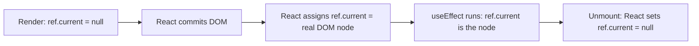

# Chapter 7 — `useRef`: DOM References and Mutable Values

> **What you'll learn**
> - The two completely different jobs `useRef` does (and why people get confused)
> - **Job 1 — DOM refs**: getting your hands on the actual `<div>`, `<input>`, etc. and what to do with it
> - **Job 2 — Mutable box**: a per-component value that survives renders but **doesn't trigger one**
> - The `ref={someRef}` attribute and what really happens when React commits
> - Why refs are an *escape hatch* — when to reach for them and when to stay in state-land
> - The TasksList click-outside pattern, walked through in full
> - Common patterns: previous-value, timer IDs, instance counters, "did I mount?" flags
> - `forwardRef` — passing a ref through a child component to its inner DOM node

After Chapters 4–6, you can build any UI driven by **state and effects**. But sometimes React's data-in/UI-out model isn't enough — you need to talk to the DOM directly, or remember a value across renders without re-rendering for it. That's `useRef`.

---

## 1. The mental model — `useRef` is a box

```js
const ref = useRef(initialValue);
```

Think of `ref` as a tiny box that React hands you on first render and **keeps the same box across all future renders**. The box has exactly one slot:

```js
ref.current   // read the slot
ref.current = newValue   // write the slot
```

Three properties make this box different from `useState`:

1. **The box itself never changes identity.** `ref` is the same object reference on render 1, render 2, render 100.
2. **Writing to `ref.current` does NOT trigger a re-render.** This is the headline feature.
3. **Reading `ref.current` always gives the latest value**, even from inside callbacks captured at an earlier render.

That's it. Everything else about `useRef` is a consequence of those three rules.

If `useState` is "data that the UI reflects," `useRef` is "data the UI does not reflect."

---

## 2. Two completely different jobs

`useRef` is overloaded. People learning React often think it's two hooks pretending to be one:

| Job | What you put in `ref.current` | Who writes to it |
| --- | --- | --- |
| **DOM ref** | A real DOM element (`<div>`, `<input>`, etc.) | React, automatically, after the render is committed |
| **Mutable box** | Any JavaScript value (number, string, object, function, timer ID) | Your code, manually |

Both are valid. Both look like `useRef(...)` and `ref.current`. But the patterns and pitfalls differ. We'll cover them separately.

---

## 3. Job 1 — DOM refs

### The basic pattern

```jsx
import { useRef, useEffect } from "react";

function Searchbox() {
  const inputRef = useRef(null);

  useEffect(() => {
    inputRef.current.focus();   // focus the input when mounted
  }, []);

  return <input ref={inputRef} placeholder="Search..." />;
}
```

What happens, in order:

1. The component renders. `inputRef.current` is `null` (its initial value).
2. React commits to the DOM, creating the actual `<input>` element.
3. **React sees the `ref={inputRef}` attribute** and writes the DOM node into `inputRef.current` for you.
4. The `useEffect` (mount-only, since deps are `[]`) runs. Now `inputRef.current` is the real `<input>`. We call `.focus()` on it.

Critical detail: **you cannot read `inputRef.current` inside the render body** — it's still `null` until React commits. Always read it inside an effect or an event handler, not during the render itself.

### The lifecycle



This is why `useRef(null)` is the universal initial value for DOM refs. The slot starts empty, React fills it, React empties it on unmount.

### Why pass `null` as the initial value?

Because there's no DOM node yet on the very first render. Anything else would be misleading. You'll see the convention `useRef(null)` *every single time* refs are used for DOM nodes. Memorize it.

---

## 4. In our app — the click-outside pattern (TasksList)

This is the textbook DOM-ref use case in our codebase. Open [frontend/src/pages/Tasks/TasksList.jsx](../frontend/src/pages/Tasks/TasksList.jsx).

The setup:

```159:160:frontend/src/pages/Tasks/TasksList.jsx
  const [menuTaskId, setMenuTaskId] = useState(null);
  const menuRef = useRef(null);
```

Two hooks working together:

- `menuTaskId` — *which* task's action menu is open right now. Or `null` if no menu is open.
- `menuRef` — the actual DOM `<div>` of whatever menu is currently open.

### The effect that listens for outside clicks

```162:167:frontend/src/pages/Tasks/TasksList.jsx
  useEffect(() => {
    if (!menuTaskId) return;
    const close = (e) => { if (menuRef.current && !menuRef.current.contains(e.target)) setMenuTaskId(null); };
    document.addEventListener("mousedown", close);
    return () => document.removeEventListener("mousedown", close);
  }, [menuTaskId]);
```

Read this slowly with the ref in mind:

1. **`if (!menuTaskId) return;`** — no menu open, nothing to listen for.
2. The handler `close` checks two things:
   - `menuRef.current` exists (paranoia — should always be true here, but defensive).
   - `menuRef.current.contains(e.target)` — the magic line. **`Element.contains(other)` is a real DOM method** that returns `true` if `other` is inside this element (or is this element itself). We invert it: if the click was *not* inside the menu, close the menu.
3. Subscribe to `mousedown` on the entire document. Cleanup unsubscribes (Chapter 5 territory).

### How `menuRef` actually gets a value

Look at the JSX:

```198:212:frontend/src/pages/Tasks/TasksList.jsx
  const renderActionMenu = (taskId) => (
    <div className={styles.actionCell}>
      <button type="button" className={styles.actionBtn} onClick={(e) => toggleMenu(e, taskId)}>⋯</button>
      {menuTaskId === taskId && (
        <div className={styles.actionMenu} ref={menuRef}>
          <button type="button" className={styles.actionItem} onClick={(e) => handleArchive(e, taskId)}>
            <span className={styles.actionIcon}>📦</span> Archive
          </button>
          <button type="button" className={`${styles.actionItem} ${styles.actionDanger}`} onClick={(e) => handleDelete(e, taskId)}>
            <span className={styles.actionIcon}>🗑</span> Delete
          </button>
        </div>
      )}
    </div>
  );
```

The key bit: `<div className={styles.actionMenu} ref={menuRef}>`.

- The menu is only rendered when `menuTaskId === taskId` for that row. So at most one menu exists in the DOM at a time.
- `ref={menuRef}` tells React: "after you commit this `<div>`, store its DOM node in `menuRef.current`".
- When the user clicks the `⋯` button, `toggleMenu` flips `menuTaskId`. React re-renders, the menu div appears, React assigns it to `menuRef.current`.
- Now the document-level click listener has a real DOM node to compare clicks against.
- When the user clicks somewhere else, `contains` returns `false`, `setMenuTaskId(null)` runs, the menu is removed from the DOM, React clears `menuRef.current` back to `null`, the effect's cleanup unsubscribes the listener.

### Why a ref instead of state?

Why not store the DOM node in a `useState`? Because:

1. **You don't want a re-render every time the DOM node attaches.** State changes trigger renders. Refs don't.
2. **You don't *render* the DOM node anywhere in your JSX.** It's just a value the click handler needs to read. Perfect ref territory.

Rule of thumb: **if the value would never appear in JSX, it's a ref.**

### Two subtle things about this pattern

- **The cleanup matters even more here than usual.** The listener is on `document`, not on the component itself. If you forgot to unsubscribe, every `⋯` click would leave a dangling listener forever. Open and close 100 menus → 100 listeners firing on every mousedown.
- **The same `menuRef` works for any open menu.** Even though there are many `⋯` buttons in the table, only *one* menu is rendered at a time, and it always grabs `menuRef`. We don't need a ref per row — just one ref pointing at "whichever menu is open right now".

---

## 5. The same pattern in `UserStoryList`

[frontend/src/components/userstory/UserStoryList.jsx](../frontend/src/components/userstory/UserStoryList.jsx) uses identical code for the same reason:

```js
const menuRef = useRef(null);

useEffect(() => {
  if (!menuTaskId) return;
  const close = (e) => { if (menuRef.current && !menuRef.current.contains(e.target)) setMenuTaskId(null); };
  document.addEventListener("mousedown", close);
  return () => document.removeEventListener("mousedown", close);
}, [menuTaskId]);
```

When you spot the same idiom appearing in multiple files, that's a hint it could be extracted into a custom hook — `useClickOutside(ref, onOutside)`. We'll do exactly that in Chapter 11 when we cover custom hooks.

---

## 6. Other classic DOM-ref patterns

You'll meet these in real React code constantly. None are in our app yet, but they're variations on the same theme.

### Focus an input on mount

```jsx
function NameInput() {
  const ref = useRef(null);
  useEffect(() => { ref.current?.focus(); }, []);
  return <input ref={ref} />;
}
```

The `?.` is defensive (in case the input wasn't rendered yet for some reason). Good habit.

### Focus an input when an error appears

```jsx
function Field({ error }) {
  const ref = useRef(null);
  useEffect(() => {
    if (error) ref.current?.focus();
  }, [error]);
  return <input ref={ref} aria-invalid={!!error} />;
}
```

When `error` becomes truthy, focus jumps to the field. Accessibility-friendly.

### Scroll to a freshly-added element

```jsx
const lastRef = useRef(null);
useEffect(() => {
  lastRef.current?.scrollIntoView({ behavior: "smooth" });
}, [items.length]);

// in JSX:
{items.map((it, i) => (
  <div key={it.id} ref={i === items.length - 1 ? lastRef : null}>{it.text}</div>
))}
```

Common in chat UIs.

### Measure an element's size

```jsx
const boxRef = useRef(null);
useEffect(() => {
  if (boxRef.current) {
    const { width, height } = boxRef.current.getBoundingClientRect();
    console.log(width, height);
  }
}, []);
```

Note: this only measures *once* on mount. For "react to size changes", use `ResizeObserver` (cleanup required).

### Read an uncontrolled input

```jsx
const inputRef = useRef(null);
const handleSubmit = () => {
  const value = inputRef.current.value;  // grab from DOM at submit time
  // ...
};
return <input ref={inputRef} defaultValue="" />;
```

Mostly an anti-pattern (controlled inputs from Chapter 4 are better), but legitimate when you really don't care about every keystroke.

---

## 7. Job 2 — Mutable box for non-render values

The other half of `useRef`. Same hook, different intent: store any value that needs to **survive across renders without causing one**.

The classic uses are:

| Use case | What lives in `ref.current` |
| --- | --- |
| Timer / interval ID | The number returned by `setTimeout`/`setInterval` |
| Previous prop value | The previous render's value of `someProp` |
| "Did I mount?" flag | A boolean that turns true once after first render |
| Latest callback | The most recent version of a callback for use in old closures |
| Counter / instance ID | An auto-incrementing number unique per render |
| WebSocket / AbortController | A long-lived object that shouldn't reset on every render |

Each of these has the same shape: the value influences behavior but not the rendered output. State would be wrong (causes pointless re-renders or feedback loops). A module-level variable would be wrong (shared across all instances of the component). Refs are the right answer.

### Pattern: storing a timer ID

```jsx
function Saver({ value, onSave }) {
  const timerRef = useRef(null);

  useEffect(() => {
    if (timerRef.current) clearTimeout(timerRef.current);
    timerRef.current = setTimeout(() => onSave(value), 1000);
    return () => clearTimeout(timerRef.current);
  }, [value, onSave]);

  return null;
}
```

Auto-save 1 second after the user stops changing `value`. The timer ID has to persist across renders (so we can cancel it from the next effect run), but it has nothing to do with the UI. Ref.

> Actually, our `TasksList` debounce in Chapter 5 used a *local* `let timer` inside the effect — which works because `useEffect` cleanup captures it through closure. The ref version is more useful when **multiple effects or handlers** need to coordinate on the same timer.

### Pattern: previous value

```jsx
function usePrevious(value) {
  const ref = useRef();
  useEffect(() => { ref.current = value; }, [value]);
  return ref.current;
}

function Counter({ count }) {
  const prev = usePrevious(count);
  return <p>{count} (was {prev})</p>;
}
```

How it works:

1. On render N: `usePrevious` returns whatever was in `ref.current` from render N-1.
2. The effect runs *after* the render, updating `ref.current` to the current value for render N+1 to read.

`prev` is always one render behind `count`. Beautifully clean — and impossible without `useRef`. State would either re-render (creating an infinite loop) or be wrong (state setters apply to the *next* render, not the previous).

### Pattern: "did I mount yet?"

```jsx
const didMount = useRef(false);

useEffect(() => {
  if (!didMount.current) {
    didMount.current = true;
    return;  // skip the first run
  }
  // only runs on updates, not on mount
}, [someValue]);
```

Useful when you want effect-on-update without effect-on-mount. (React StrictMode in dev runs effects twice, so this pattern needs care — but the principle holds.)

### Pattern: holding the "latest" callback

```jsx
function useLatest(value) {
  const ref = useRef(value);
  useEffect(() => { ref.current = value; });
  return ref;
}

function Timer({ onTick }) {
  const onTickRef = useLatest(onTick);
  useEffect(() => {
    const id = setInterval(() => onTickRef.current(), 1000);
    return () => clearInterval(id);
  }, []);  // empty deps — interval never resets
}
```

Without the ref, you'd have to put `onTick` in the effect deps. That would tear down and rebuild the interval every time the parent re-renders with a new callback reference. The ref lets you keep the interval alive while always calling the latest callback.

This pattern is the foundation of many production custom hooks.

---

## 8. Refs vs. state — the decision matrix

| Question | Use `useState` | Use `useRef` |
| --- | --- | --- |
| Does the UI need to update when this changes? | Yes | No |
| Will I render this value somewhere? | Yes | No |
| Is this a value that influences the next render's output? | Yes | No |
| Is this a DOM element? | No | Yes |
| Is this a timer ID, listener, or other "behind the scenes" value? | No | Yes |
| Do I want a re-render when I write to it? | Yes | No |

**Litmus test:** "If this changes, should the screen change?" Yes → state. No → ref.

---

## 9. Common mistakes

### Mistake 1 — Reading `ref.current` during render

```jsx
function Bad() {
  const ref = useRef(null);
  return <div>{ref.current?.offsetWidth ?? "no width"}</div>;  // ❌
}
```

`ref.current` is `null` on the first render. Even on the second render, it's read *during* render — but writes to refs aren't tracked, so React doesn't know to re-render when refs change. You'll get inconsistent UI.

Read refs inside effects and event handlers, not in the render body.

### Mistake 2 — Expecting a re-render after `ref.current = newValue`

```jsx
const countRef = useRef(0);
return <button onClick={() => countRef.current++}>{countRef.current}</button>;  // ❌
```

The button label never updates. Refs don't trigger re-renders. If you want a counter that displays, use `useState`.

### Mistake 3 — Storing values in state that should be refs

```jsx
const [timerId, setTimerId] = useState(null);  // ❌ unnecessary re-render
```

Timer IDs aren't displayed anywhere. Save the render — use a ref.

### Mistake 4 — Storing values in refs that should be state

```jsx
const tasksRef = useRef([]);
// ... add a task
tasksRef.current.push(newTask);
// the screen doesn't update. you wonder why for an hour.
```

The screen isn't updating because nothing told React to re-render. Tasks display in JSX → use state.

### Mistake 5 — Forgetting `useRef(null)` for DOM refs

```jsx
const ref = useRef();   // ⚠️ ref.current is undefined on first render
```

Works in practice but it's a smell. Always `useRef(null)` for DOM nodes. The convention exists for a reason: it's a clear visual marker that "this is a DOM ref".

---

## 10. `forwardRef` — passing a ref through a component

Here's a problem. You write:

```jsx
function FancyInput(props) {
  return <input {...props} />;
}
```

And try to use it from a parent:

```jsx
const inputRef = useRef(null);
return <FancyInput ref={inputRef} />;  // ❌ doesn't work
```

React warns: *"Function components cannot be given refs."* Why? Because `ref` is a special prop name that React intercepts — it doesn't pass through to the component as a regular prop.

Fix: wrap in `forwardRef`:

```jsx
import { forwardRef } from "react";

const FancyInput = forwardRef(function FancyInput(props, ref) {
  return <input {...props} ref={ref} />;
});
```

Now the parent's `inputRef` reaches the actual `<input>`. Use this whenever you build a reusable input/button/control that callers might want to focus, scroll, or measure.

> **React 19 update**: forwarding `ref` is becoming a regular prop — you'll be able to write `function FancyInput({ ref, ...props }) { ... }` directly. Our app uses React 19, so you can use either style. `forwardRef` is still everywhere in older code, so know it.

We don't currently expose ref-forwarding components in our app, but as you build reusable design-system pieces, this becomes essential.

---

## 11. Try it yourself

### Exercise 1 — Auto-focus on open

You have a modal that mounts when `isOpen` becomes true. Make the first input inside it automatically focused on open.

<details>
<summary>Solution</summary>

```jsx
function Modal({ isOpen, onClose }) {
  const inputRef = useRef(null);
  useEffect(() => {
    if (isOpen) inputRef.current?.focus();
  }, [isOpen]);
  if (!isOpen) return null;
  return (
    <div className="backdrop" onClick={onClose}>
      <div className="modal" onClick={(e) => e.stopPropagation()}>
        <input ref={inputRef} placeholder="Type here" />
      </div>
    </div>
  );
}
```

The dep is `[isOpen]` so the focus runs every time the modal re-opens.
</details>

### Exercise 2 — Spot the bug

```jsx
function Counter() {
  const ref = useRef(0);
  return (
    <button onClick={() => { ref.current++; }}>
      Count: {ref.current}
    </button>
  );
}
```

Why is the button label always "Count: 0"?

<details>
<summary>Answer</summary>

Writing to `ref.current` doesn't trigger a re-render. The label only ever reflects whatever was rendered. To make this work, use `useState`:

```jsx
const [count, setCount] = useState(0);
return <button onClick={() => setCount((c) => c + 1)}>Count: {count}</button>;
```
</details>

### Exercise 3 — Should it be a ref or state?

For each, decide:

a. The current value of a search input
b. The ID returned by `setInterval` so we can cancel later
c. The list of search results
d. The DOM node of a tooltip used to position other tooltips
e. A boolean flag "have we already shown the welcome toast this session?"

<details>
<summary>Answers</summary>

a. **State.** The input renders the value. Controlled input.
b. **Ref.** Not displayed anywhere; would cause pointless re-renders.
c. **State.** Renders into the page, must trigger re-render.
d. **Ref.** A DOM node, never rendered itself.
e. **Ref.** Influences behavior, not rendering. (If you wanted to disable a re-show button visually, then state.)
</details>

### Exercise 4 — Click outside, generalized

Implement a `useClickOutside(ref, handler)` hook that calls `handler()` whenever the user clicks anywhere outside the element pointed to by `ref`.

<details>
<summary>Solution</summary>

```jsx
function useClickOutside(ref, handler) {
  useEffect(() => {
    const onDown = (e) => {
      if (ref.current && !ref.current.contains(e.target)) handler();
    };
    document.addEventListener("mousedown", onDown);
    return () => document.removeEventListener("mousedown", onDown);
  }, [ref, handler]);
}

// usage
function Menu() {
  const ref = useRef(null);
  const [open, setOpen] = useState(true);
  useClickOutside(ref, () => setOpen(false));
  if (!open) return null;
  return <div ref={ref}>menu content</div>;
}
```

This is exactly the refactor we'll do to our `TasksList`/`UserStoryList` duplication in Chapter 11.
</details>

---

## 12. Cheat sheet

| Concept | One-liner |
| --- | --- |
| Create a ref | `const ref = useRef(initialValue)` |
| DOM ref initial | `useRef(null)` — convention for DOM nodes |
| Attach to DOM | `<div ref={ref}>` |
| Read DOM node | `ref.current` (only inside effects/handlers, never during render) |
| Mutate ref | `ref.current = newValue` (no re-render) |
| Detect "outside click" | `ref.current?.contains(e.target)` |
| Pass ref through component | `forwardRef` (or React 19's prop-style `ref`) |
| Stable identity | `ref` itself never changes; only `ref.current` does |
| Right tool? | "Will the screen change?" Yes → state. No → ref. |
| When ref triggers re-render | **Never.** That's the whole point. |
| Common mistakes | Reading during render; using ref where state is needed; using state where ref is needed |

---

## 13. What's next

You now understand all four primitive hooks: `useState`, `useEffect`, `useCallback`/`useMemo`, `useRef`. With these alone, every React app from a counter to Figma is built.

But hooks have rules. Break them and React will error in confusing ways, or worse — silently misbehave. Before we go further into architecture, we need to make those rules concrete and look at the *pitfalls* you'll inevitably hit.

**Chapter 8** dissects:

- The two **Rules of Hooks** (and why they exist)
- The **stale closure** trap — your effect/callback captured an old value
- Missing dependencies — why ESLint nags and when you can ignore it (almost never)
- The "render too often" trap — when state/effect/setX form an unwanted loop
- The **`useEffect` runs twice** confusion in StrictMode
- Common error messages and what they really mean

When you're ready, ask for **Chapter 8 — Rules of Hooks & Common Pitfalls**.

After Chapter 8 you'll have rounded out **Part B — State & Hooks** completely. Then Part C dives into application architecture: routing, contexts, layouts, the things that make a one-component demo into a real app.
